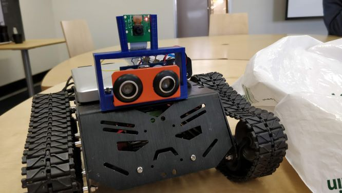
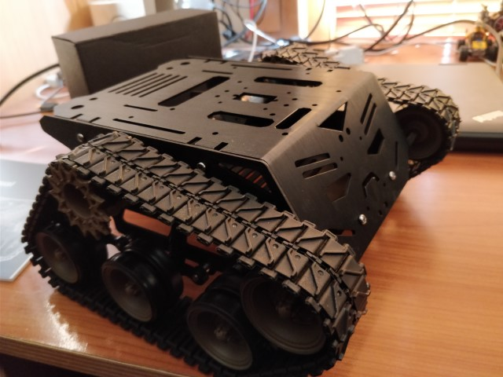
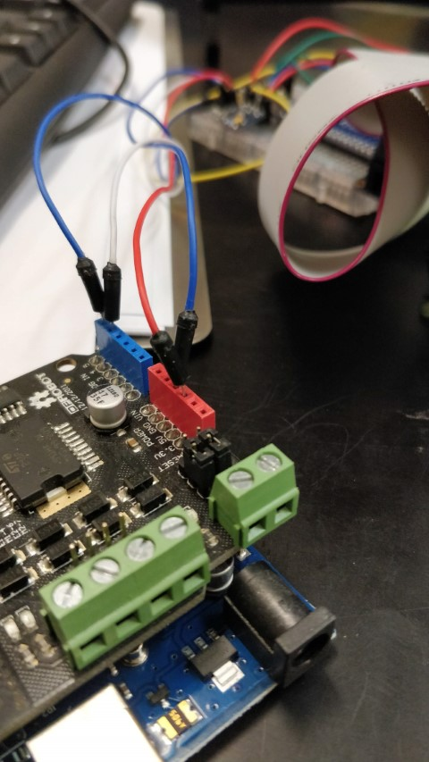
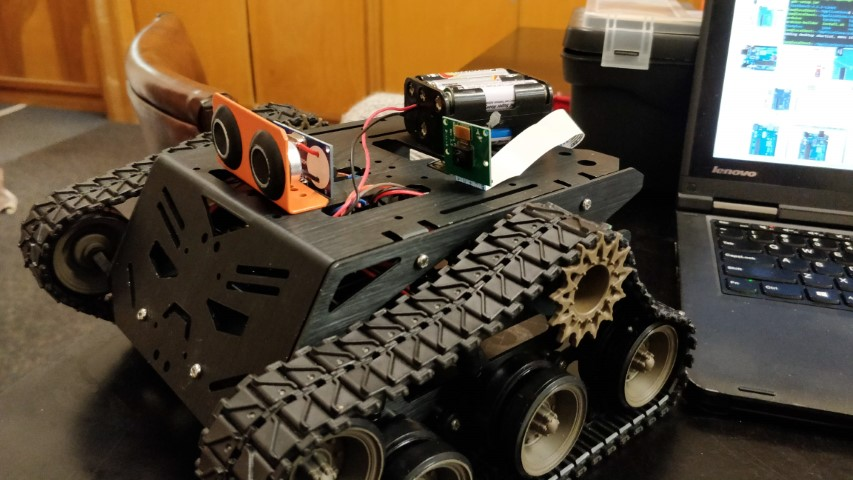
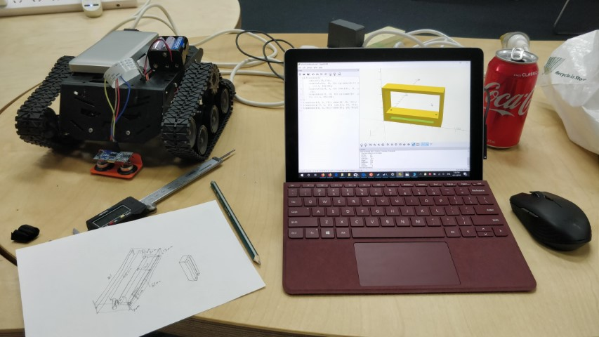
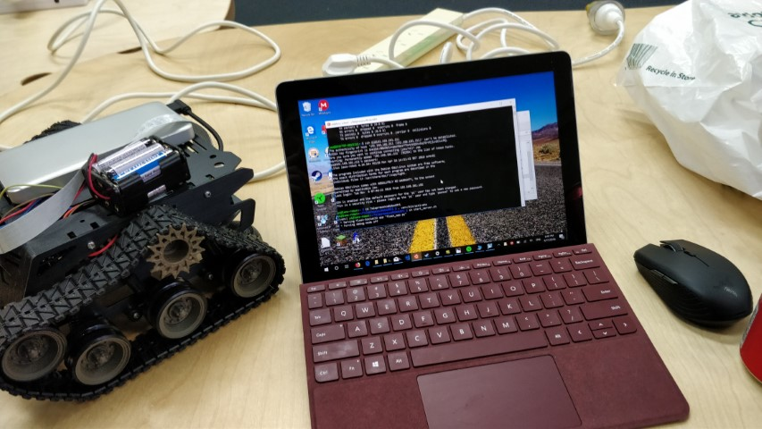
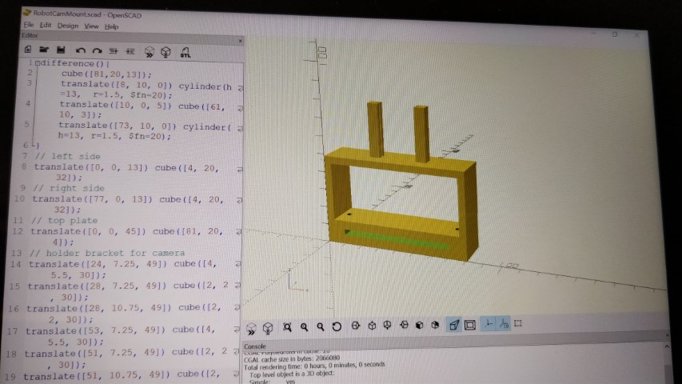
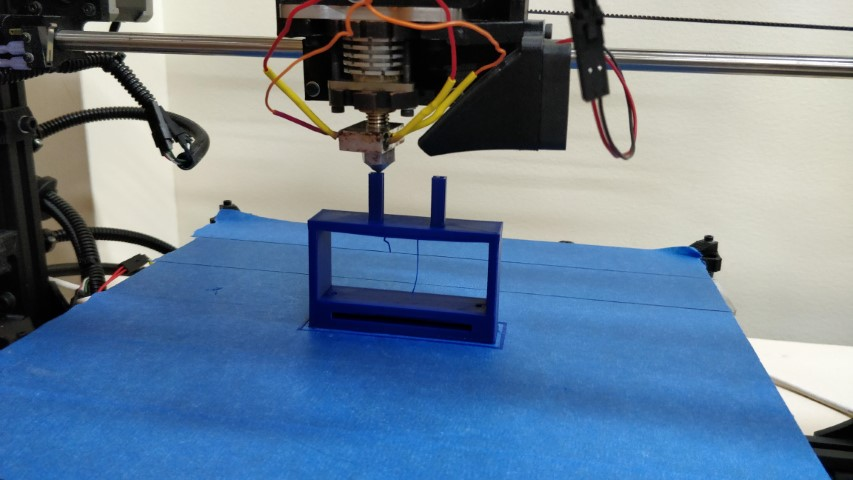

# Telepresence Robot

[plugin:youtube](https://www.youtube.com/watch?v=D6k-XM3IQfs)
I have made a robot designed to be used as a telepresence robot. It has a camera and speaker. You use a web interface to see through the camera and control the movement with clickable buttons.
It uses web sockets to communicate between the remote viewer and the robot itself. It is powered by a Raspberry Pi (1st gen) and an Arduino Uno with motor controller shield, communicating via I2C bus to send motor movement commands. 

[:fa-github: Source for the Raspberry Pi](https://github.com/l33tllama/TelepresenceRobotRPi)  
[:fa-github: Source for the Arduino](https://github.com/l33tllama/TelepresenceRobotArduino)

### After first putting the chassis together

### Wiring up the motor controller

### Adding the ultrasonic sensor

### Controlling the motors with Python
[plugin:youtube](https://www.youtube.com/watch?v=Z6BGdTYLNy8)

### Designing the ultrasonic and camera sensor mount

### SSH into the robot

### Designing the ultrasonic and camera sensor mount 2

### 3D Printing the camera and ultrasonic sensor mount

### Video of the 3D printer printing the sensor mount
[plugin:youtube](https://www.youtube.com/watch?v=tZQgHE-QK3w)