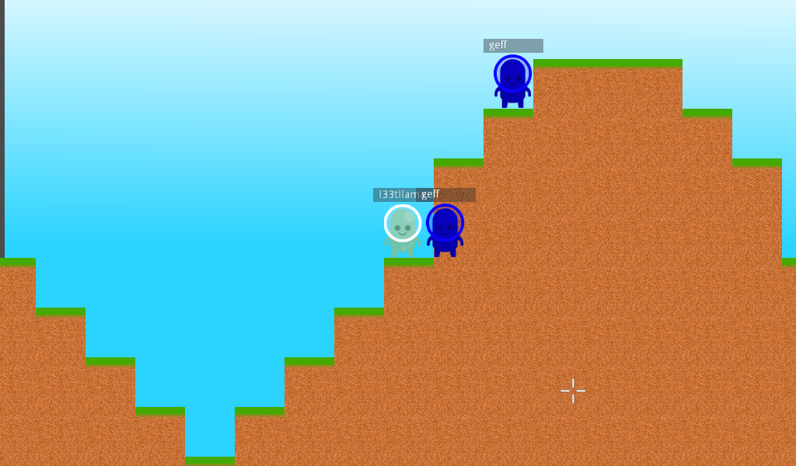

# Alien Sandbox Defense (Incomplete)
This game is a 2D sandbox, similar to Terraria and Starbound. The goal was to have swarms of aliens attack you, and you and others fight against them with rockets. You can also destroy and build blocks.
The multiplayer movement and rockets work, but no terrain modification or enemies have been implemented yet.
This game was made for TasJam at home - a game jam run by Tas Game Makers, which each team participated from home (due to Coronavirus restrictions) over the dates 30 April - 3 May 2020.
Made with Godot engine, backend made with NodeJS, websockets and RethinkDB.

[Play Online!](http://leostelepresencerobot.com/Sandbox.html)
[Itch.io page - including download](https://l33tllama.itch.io/alien-sandbox-defense)