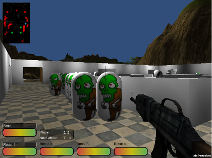

# Brain in Jar Defense

**Platform:** Web (+ PC + Mac)  
**Engine & languages:** Unity  
**About:** Made in 'Games Design and Production' unit at UTAS in 2011. A hybrid tower defense / FPS. You play as one of 4 robots which you can switch between using number keys. You have to defend against zombies which are trying to get to a giant brain which is controlling the robots. Made with Unity. Note: requires Unity web player - works best with Mozilla Firefox on Windows and Mac.