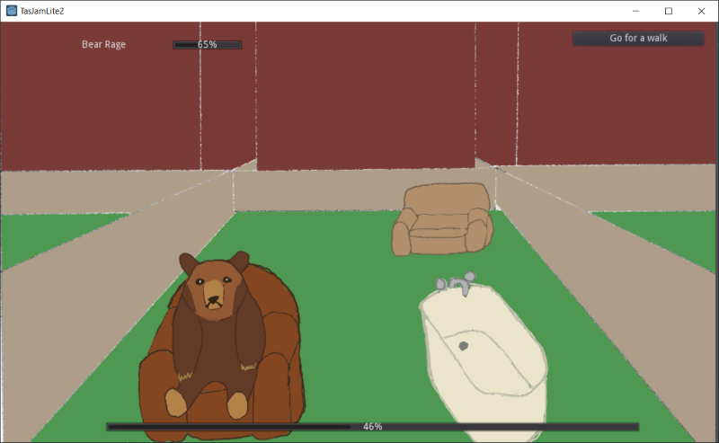

# Calming Bruce (Your Pet Bear)

Calming Bruce is a minigame game where you do activities to calm your pet bear, to stop it from attacking you.
It was made for TasJam Lite 2 (6-7 July 2019) at Enterprize Hobart. 
Made with the Godot engine.

[:fa-gamepad: Itch.io page - including download](https://l33tllama.itch.io/calming-bruce-your-pet-bear)
