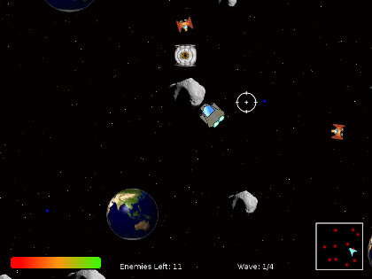

# Colony Defender
  
**Platform:** Web (Flash)  
**Engine & languages:** Actionscript  
**About:**
A space shooter made for Games Fundamentals course at UTAS in 2011. Has a minimap, enemies with varying difficulty and Nyan cat. 
Note: the game runs most reliably in Firefox with flash plugin. 

[:fa-download: Download](ColonyDefender.swf)
