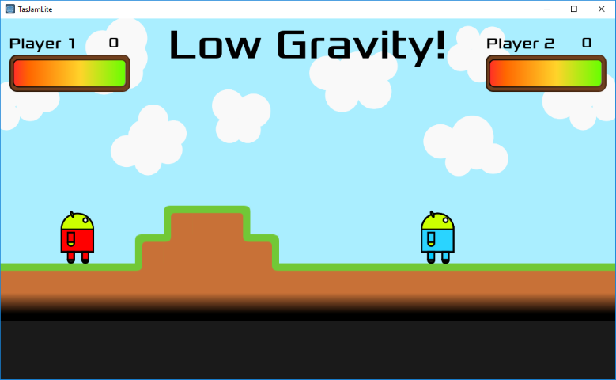

# Gravity Flux

[:fa-gamepad: itch.io page](https://l33tllama.itch.io/gravity-flux)

Gravity Flux is a 2-player local multiplayer game, where you shoot fireballs at the other player. Randomly throughout the game, the gravity decreases in strength to a very low amount, which causes the players to be able to jump higher and the fireballs to take longer to fall.

Gravity Flux was made for TasJam Lite (2018)
