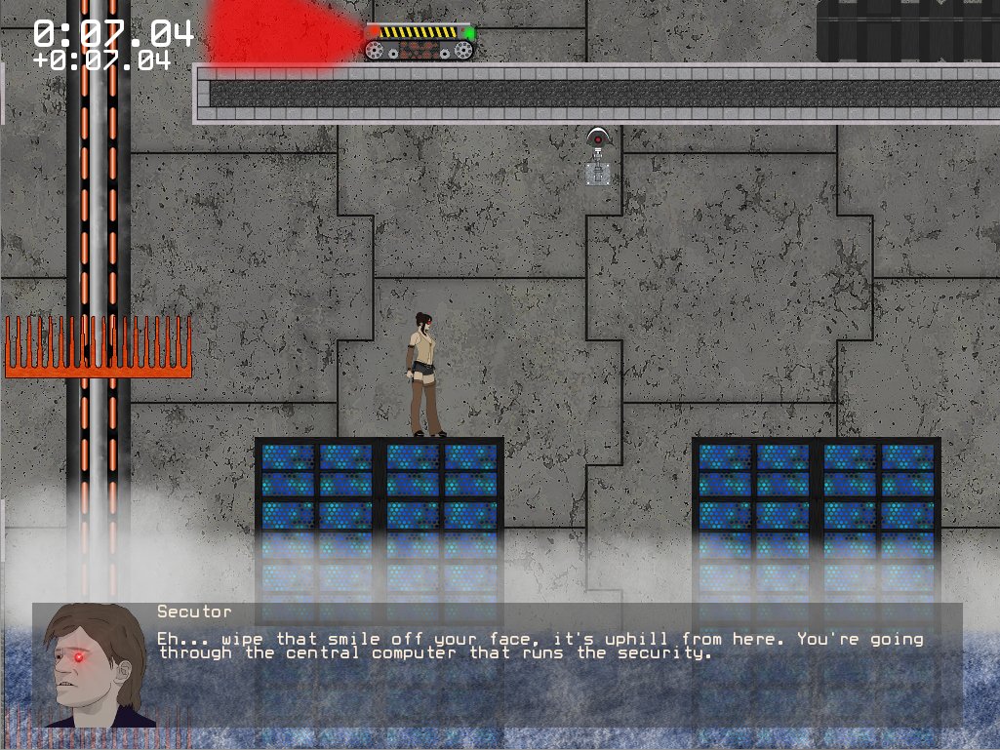

# Mesonoxian
  
**Platform:** PC ( Windows)  
**Engine & languages:** Custom-made using C++ (ClanLib) and lua  
**About:** Mesonoxian is a 2D sidescroller like Mario and Sonic, but set in the fictional dystopian future. You have to steal treasure from people, usually the oppressive authorities. The goal is to get to the end of the level by avoiding traps. You can wall-jump. The game was made by a team of 8 incl. myself for my final UTAS year-long software project in 2012. I made some level textures, level designs, the particle physics system, the in-game help system and other misc taks such as documentation. 

Download not yet available
