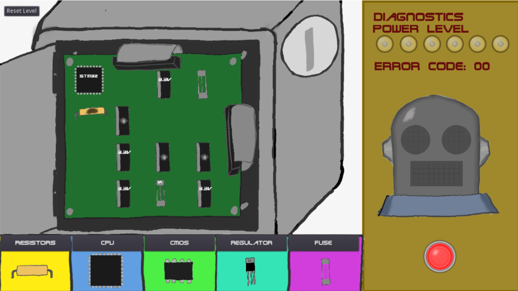

# Robo Repair
Robo Repair is a puzzle game where you are trying to replace blown components in a robot. 
It was made for Global Game Jam 2020 (31 January-02 February), organised by a member of Tas Game Makers. It ran at Enterprize Hobart.
Made with Godot engine.

[Itch.io page - including download](https://l33tllama.itch.io/robo-repair)