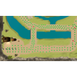

#Tanks For the Sheep
  
**Platform:** Web (and PC + Mac)  
**Engine & languages:** Unity  
**About:** The game was made for a University assignment for the unit 'Advanced Games development'. It uses a path-finding algorithm to search through nodes on the map for the shortest path from one point to another. Your aim is to move your sheep which has a turret on it's back around and shoot other sheep which also shoot back.

[:fa-gamepad: Play](../../ext-pages/tanks4sheep/TanksForTheSheep.html)