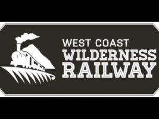
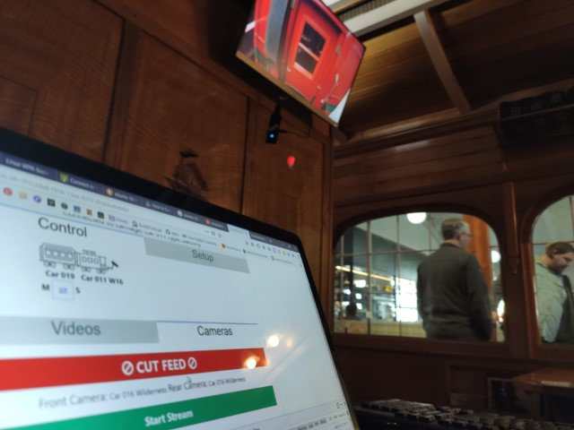
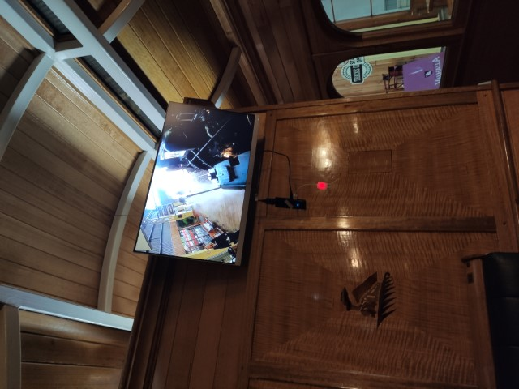

#West Coast Wilderness Railway Camera Viewing System

## Description
I have had the great fortune of working with the [West Coast Wilderness Railway](https://www.wcwr.com.au/), a history railway tourist attraction in Queenstown Tasmania.
Through [Anderson Morgan](https://andersonmorgan.com.au/) - the company I was working for, I developed a software system for controlling screens on a train.
The screens in each carriage display live views of the front and back of the train, thanks to wireless IP cameras attached to the trains and carriages, and the system that I wrote to control the screens.
This was a challenging project, because the train configuration can change regularly. So the software that controls the camera views needs to be aware of other carriages and trains "on the network".
I developed the process for discovering devices and communicating between devices.
The staff can use a web interface on a tablet to configure the system in a simple process of tapping buttons to say what camera to be on what screen.
The system runs on Intel Compute Sticks, running Ubuntu Linux, attached to each display.
Each stick is aware of each other, and can communicate data, such as camera addresses, and start and stop commands between each other.
The project was developed from January 2019-January 2021, very intermittently, depending on budget and client deadlines.
There may be room to add more features and polish to the project in the future.  
  

  

  

## Technologies
* Ubuntu Linux desktop (Ubuntu MATE 18.04)
* Web technologies for staff web interface
* Python for the main program on each Compute Stick
* Linux System.D
* VLC command-line
* VPN for remote maintenance (OpenVPN)

