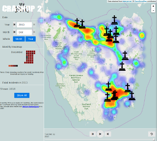

# CrashUp V2

**2014** - Crashup V2 is a visualisation of car crashes across Tasmania over several years. It shows crashes as a heat map as well as individal crash markers that are clickable.

It is a remake of an original GovHack entry for GovHack 2014 team Hobart Hackerspace.

See the live site [here](../../ext-pages/crashup-v2/)