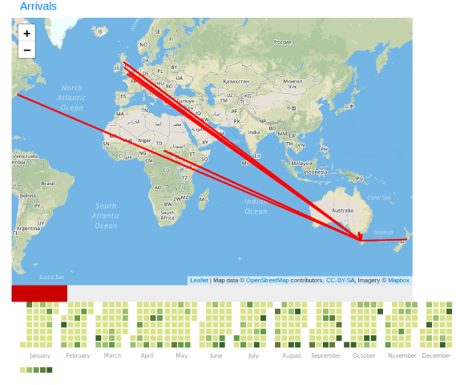

# GovHack 2018 Entry

For GovHack 2018, my team worked with the Tasmanian historic boat arrivals dataset. We worked on different tasks, including formatting the data for better usability and presenting it in an interactive web page where it shows where each person came from on particular days.

[Live site](../../ext-pages/govhack2018)  
[:fa-github: Source](https://github.com/l33tllama/GovHack2018TasArrivals)