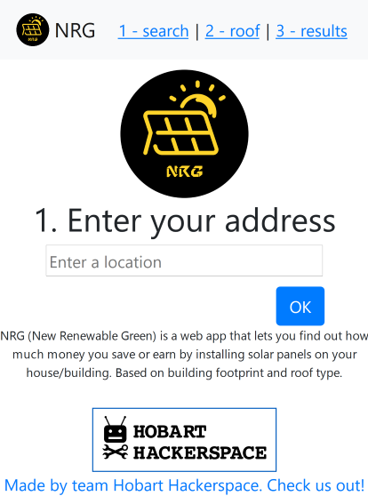

# GovHack 2019 Project Entry - Project NRG (New Renewable Green)

For the 2019 GovHack (Australian national government open data hackathon) I joined a team and was the main coder. Out project was about using your home address to calculate the savings or earnings you would make by installing a solar panel.
It uses building footprint data to calculate the approximate roof size and then how many solar panels you could fit on your roof. Then is uses a bit of approximated math to calculate the earnings or savings based on your average power usage.

It was made with Python and Flask as a backend, bootstrap and jQuery as a frontend. It polls a PostGIS database for building footprint data.

We won several awards, including:
 * Climate Change Issues in Hobart
 * Most Outstanding Tasmanian Benefit
 * Best Use of Tasmaninan Spatial Data

 Netting us a bit of prize money! And a small possibility to make this app into a real-world more polished app.

 See the currently live website [HERE](http://nrg.hobarthackerspace.org.au)