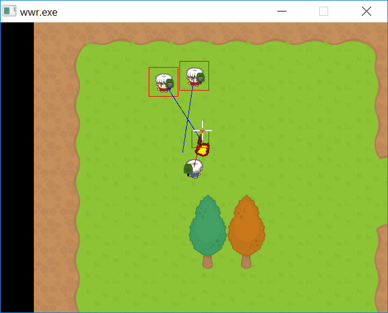

# Wizards with Rockets

 

Wizards with Rockets is a top-down shooter for Windows and Linux.
It features AI and multiplayer. 
It is made with the Allegro 5 library and C.  

[:fa-gamepad: itch.io page](https://l33tllama.itch.io/wwr)

  
Demonstration of player movement and AI random movement. Also rockets.

  
Loading in multiple AI from Tiled editor. And following the player.

  
Showing off rocket explosion animations.

  
The client updating its position to the server and the server displaying the client.

  
Having an issue with the networking code.

.mp4)  
Client updating properly on the server again.

  
Bi-directional updates from client to server and server to client.

  
One of the AI is updating on the client.

  
Rockets somewhat updating on the client side.

  
Players and enemies now have rocket launchers on their sprites.

  
The AI look at the player when the player moves around.
