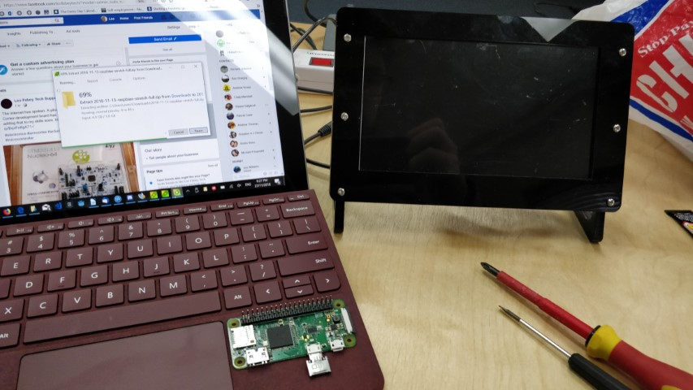
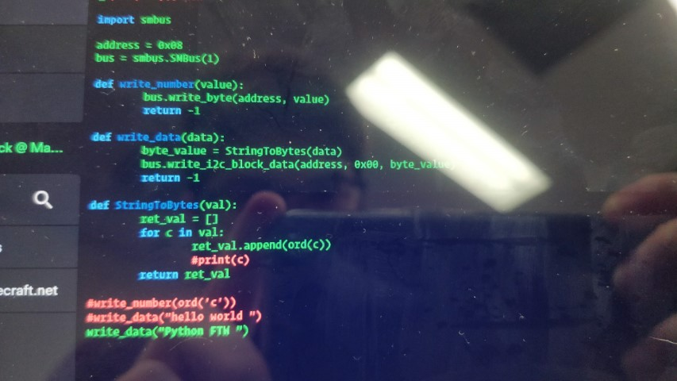

# Internet Radio Alarm Clock

I am currently making an alarm clock that plays internet radio stations for it's alarm.

It is using a Raspberry Pi Zero W as the main controller, and an Arduino for controlling the LCD and rotary encoder. It also has a [Phat DAC](https://shop.pimoroni.com/products/phat-dac) attached for audio output.

The Pi has installed [Mopidy](https://www.mopidy.com/), which is used to add internet radio stations to the MPD server.

[:fa-github: Raspberry Pi Code](https://github.com/l33tllama/NetRadioAlarmClockPi)  
[:fa-github: Arduino Code](https://github.com/l33tllama/NetRadioArduinoI2CSlave)

  
Beginning of the project.

  
Reading the RTC (Real Time Clock) from Arduino. Later moved RTC to Raspberry Pi so it could get the time from the RTC directly. [Using RTC with Raspberry Pi](https://learn.adafruit.com/adding-a-real-time-clock-to-raspberry-pi/set-rtc-time)

  
Sending a string from Python on the Raspberry Pi to the Arduino and displaying it on the LCD. The LCD is a ST7920 and I'm using the [u8glib ](https://github.com/olikraus/u8glib) library.

  
I installed Mopidy and python-mpd to read the current radio station name from Python, and send it to the Arduino and LCD via the I2C bus.

  
Editing the Python code for I2C communication over SSH in nano. Using Termius for Windows.

  
Drawing a circular clock on the LCD using the u8glib library's drawing facilities. Time sent to the Arduino from the Raspberry Pi over I2C bus.

[plugin:youtube](https://youtu.be/CWdYdhCGLeg)  
Controlling the volume with rotary encoder. Updating volume on-screen.

  
Using Google Calendar Python API to get my calendar events. It uses OAuth authentication, which required running a local web browser on the Raspberry Pi and attaching an HDMI LCD.