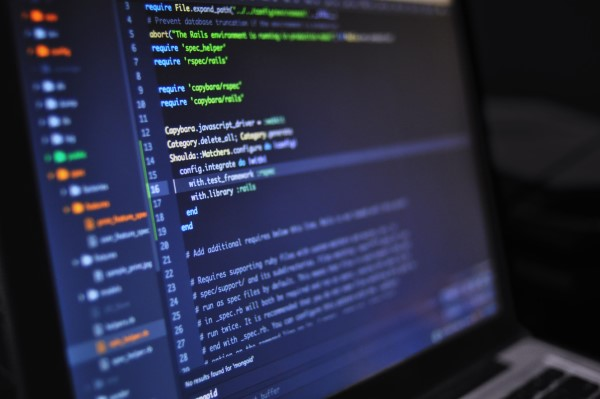

# Why I think iPads aren't the future of computing (But they're something)

iPads are very popular and clearly people like them. But they can't do everything that traditional PCs can do, and they are somewhat restricted to people with loads of money (first-world middle-class upwards).

## Reason 1 - No developer tools
If you like programming, the iPads aren't great at satisfying your interests/professional skills. You can't develop software with an iPad. There are no compilers, desktop-inspired IDEs or development environments on the iPad*. This means that if you have an interest in software development, or are even doing it professionally, you can't replace your laptop/desktop with an iPad. This is also bad from the perspective of being an independent ecosystem - the iPad still relies on PCs/Macs to develop software for it. So the iPad couldn't exist without the Mac, and that makes the iPad not applicable to being 'the future of computing' like Steve Jobs said it would be. Also, it increases the cost of being a developer, you need an expensive Mac.

*Other than Swift - which still won't let you create and publish iPad apps on the iPad itself.

## Reason 2 - Price
The cheapest iPad that you can buy is $529 AUD. I just bought an Android tablet which is fairly sufficient for my needs for under $300. And this iPad isn't even that great - It doesn't have a laminated screen, which means that the screen has an air gap between the glass and the LCD. In my experience, this makes tapping on the iPad sound like your tapping on a hollow object. Which is a bit yucky. My $300 Android tablet is laminated.  

An iPad Air (consumer level) costs $779 AUD. This is still a 'consumer' tablet. That is, a device not designed for 'professionals'. You can buy Core i5 laptops with a SSD for this price - and they include a keyboard, more ports, more RAM, more storage. For a device that is ultimately a compliment to a laptop or desktop, the price is a bit high.  

Then there's the 'Pro' iPads. Hoo boy are they expensive. $1,229 AUD for a mere 64GB of storage. I will say one good thing about them, their processor is an absolute beast. It rivals laptop Core i5 and i7 CPUs - that generally need a fan. The funny thing is that the iPad is still just a big touch screen with no significant hardware specs eating up the price. No massive amount of RAM, no graphics card, no 4K screen, no CPU that requires substantial cooling.  Also, no fancy backlit keyboard that has had significant R&D.

So if you want an iPad, you've got a pay up big time. There's no 'budget' iPad (other than the $529 model, which is still a bit high). Considering that for a lot of people, an iPad is a compliment to their laptop, the iPad is quite expensive for what it does - which is merely social media, entertainment, casual games, chat, etc. All of those things don't need a particularly good device to handle them. As said, my $300 Android tablet handles casual use pretty well.

## Reason 3 - Keyboard
The official Apple Smart Keyboard accessory for the iPad models is the most elegant keyboard for using with an iPad. You could also use Bluetooth keyboards, but they are either separate devices, or physically attached, but don't integrate with the iPad's power supply. 
The problem with the Smart Keyboard is that it doesn't have a very 'laptop-like' feel. The keys are fabric-covered and can feel weird compared to chiclet keys. You need to experience it for yourself - maybe it's ok for you, but personally I don't like it as much as a real keyboard. My Surface Go has real plastic chiclet keys and it feels great to type on (albeit a little cramped).

## Unrealistic Reason 4 - Other OS's
Apple will never allow you to run other OS's. They just don't like people using their hardware in ways they didn't intend it to be used. They want absolute control over the hardware. I believe their reasoning is to ensure a good user experience - if people go and install another OS, they will have an "inferior" experience, by their terms. But I also believe it is to stomp on competition. If someone provides a similar experience in another OS, but outside of their app store ecosystem, Apple wouldn't like that, because they can't make money out of it.  

However, having another OS would open up doors to the things some people would want - like being able to use it for software development. And using real open-source software (Apple is a bit tricky when it comes to publishing open source software on the app store). For now, you'll just have to buy an Android tablet if you want some of those things not available on iOS. But Android tablets are a very mixed bag of quality.

## Summary
So the iPad can't quite replace the laptop (for everyone). But it is priced on par with a laptop. And the keyboard is inferior to a laptop's keyboard. I can see that if you use your iPad a lot - more than a laptop, and possibly in a professional sense, it can be justifiable. However, it arguably still fits into the category of 'Laptop complement' for a lot of people. Where it doesn't need to be that good, and people still use their laptop for serious tasks.  

So my argument is that the iPad needs to become a true laptop replacement to justify the price tag (for everyone). Heck, I might buy one and use it a bit if I can do development on it. It's an overall nicer experience than Windows.   

But for now, it's more than what you need for most people, as a casual device. But it's still not able to replace the laptop.

### Footnote - personal iPad ownership
I had an iPad Mini gen 4 (128GB) for about 18 months total. It was a really nice device for my tasks - reading the news, social media, emails. After 6 months of ownership, I sold it and bought a 2018 iPad (non Air or Pro). Mainly because I wanted a bigger screen for video, and that iPad supported the Apple Pencil. I kind of hated that iPad because of the non-laminated screen, and the LCD wasn't great for darker videos (eg. TV in the 90s). The laminated screen made it feel so cheap and tacky. And the LCD image quality was oversaturated and didn't handle high contrast very well. So I sold that again and bought another iPad Mini. 

I had the iPad mini for another year, however I finally decided that I wanted something better for videos, due to the small, 4:3 screen. I'd be inclined to get out my Surface Go for video, though my Surface Go was a bit cumbersome to use as a tablet, and lacks the tablet apps. 

So I sold the iPad Mini and bought a cheap Android 10" tablet*. It's a very nice all-rounder. However, I do miss the iPad. It had a little bit better UX than my Android tablet - apps look and run better. But the Android tablet is fine. If I were to have an iPad, it would be an iPad Air. But there's no way I can justify spending $779+ on an iPad (on my current income) just to do basic tasks. So until I'm rolling in money, I'll probably stick to my Android tablet, which so far has exceeded my expectations for an Android tablet. 

*My tablet - Lenovo Tab M10 32GB. Full HD, 3GB RAM, Octo-core CPU. It feels like a cheap Nexus 10 with more current specs.

