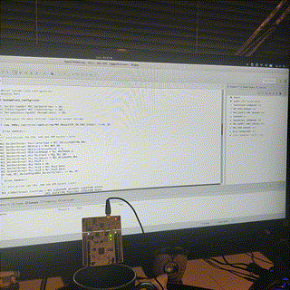

# STM32 in Linux tips



This is a quick guide to doing STM32 development in Linux, in my case Fedora 30.

First you need to download OpenSTM32 System Workbench and optionally but highly recommended, STM32CubeMX from ST (Google).


Importantly, you need to install stlink package on your Linux distribution's package manager. Then, reload the udev USB rules to enable USB support for the relevant hardware IDs. The udev rules get installed with the stlink package, so no need to manually copy them.


```bash
sudo dnf install stlink
sudo udevadm-control --reload-rules
```

Another important note is that you cannot share a workspace with one created in Windows. I discovered this the hard way. So I created a new workspace just for Linux. Otherwise You can't upload programs nor debug. Debugging yields the 'OpenOCD binary not found' error.

Additional note! ***(edit 02/07/2019)*** for live debugging to work, you need to install the 32bit version of ncurses library. In Fedora, it's
```bash
sudo dnf install ncurses-compat-libs.i686
```

All going well, after creating a sample project using STM32CubeMX and importing it, you should be able to get the blinking LED!

Useful resource:

[https://fishpepper.de/2016/09/16/installing-using-st-link-v2-to-flash-stm32-on-linux/](https://fishpepper.de/2016/09/16/installing-using-st-link-v2-to-flash-stm32-on-linux/)

### Update 03/07/2019

So, I've just discovered STM32CubeIDE. Funny how I go and write a blog post on something then discover it's been outdated.

It is essentially OpenSTM32 and STM32CubeMX combined into one program, streamlined for easy modification of microcontroller settings.

It works well except project creation doesn't work for the Wayland renderer. To fix it, edit the exec command for the application shortcut found in /usr/share/applications/st-stm32cubeide-x.x.x.desktop.

```
Exec=env GDK_BACKEND=x11 /opt/st/stm32cubeide_1.0.1/stm32cubeide %F
```

