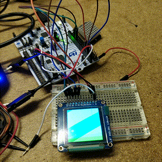
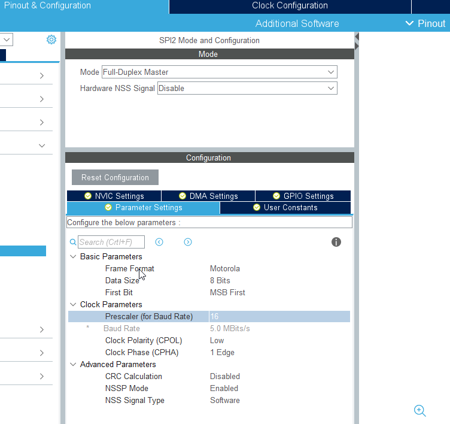
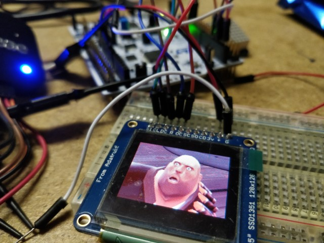

# SPI OLED Display for STM32

*be sure to read the important note!*



After a while of it not working, I managed to get the Adafruit SPI OLED display to work, controlled by a STM32 microcontroller.

SPI is another bus interface that microcontrollers use to talk to peripherals. It is like I2C, but it is limited to one device per port. It is however much faster, which is ideal for things like displays and audio.

I found an excellent library on the net by a Russian person, for the SSD1351 OLED module 
[https://github.com/afiskon/stm32-ssd1351](https://github.com/afiskon/stm32-ssd1351)

(Russian blog post)
[https://eax.me/stm32-ssd1351/](https://eax.me/stm32-ssd1351/)

Modifications had to be made to make it work.

I had to define the correct pins for the DC, Reset and OLEDCS GPIO output pins. In the STM32CubeIDE software, you can just click on the pins that you have access to (for example on an Arduino breakout header) and set those up.

In the ssd1351.h file, you may need to change the spi port and GPIO pins. I named the GPIO pins in the software, which makes readability better.

```C
/*** Redefine if necessary ***/
#define SSD1351_SPI_PORT hspi2
extern SPI_HandleTypeDef SSD1351_SPI_PORT;

#define SSD1351_RES_Pin       RESET_Pin
#define SSD1351_RES_GPIO_Port RESET_GPIO_Port
#define SSD1351_CS_Pin        OLEDCS_Pin
#define SSD1351_CS_GPIO_Port  OLEDCS_GPIO_Port
#define SSD1351_DC_Pin        DC_Pin
#define SSD1351_DC_GPIO_Port  DC_GPIO_Port
```

I also made sure to include the main.h which had the pin definitions.

You will also need to change the #include "stm32xxxx_hal.h" to your particular board in the ssd1351.c file.

## Important Note on SPI data width and bus speed

For a while I was looking at a blank screen, not sure why it wasn't working. After checking the project file's .ioc file (STM32CubeMX chip settings definitions), it had different SPI settings to mine. So I changed them to match it.

Importantly, I changed the Data Size to **8 bits**
And Prescaled to **16**



STM32CubeIDE does not seem to include a programmer functionality. But you can download STM32CubeProgrammer software. Which I used to upload programs.

After that, it should work!



