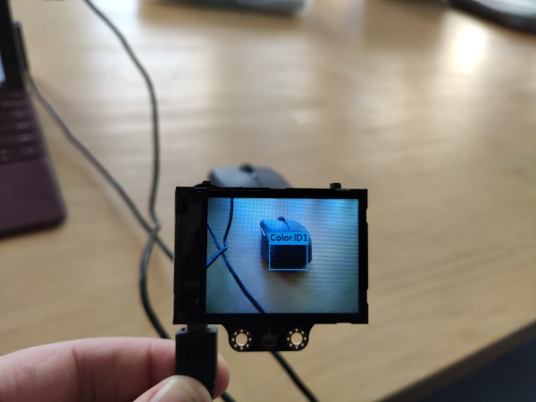

# New Robotics Workshop and Patreon

I'm posting this for those who've subscribed to my blog and haven't checked my website yet.

I have some exciting developments. I will be running a beginners robotics workshop some time this year and I've created a Patreon page.

The workshop information is listed on the new Workshops section of my website, [here](https://leofebey.com/workshops/robot-workshop-circuitpython-beta). It lists the event info and has a sign up link to register your interest. It also lists the likely parts that will be used for the workshop. My aim is to share my knowledge of programming, electronics to people who don't know a lot about it but would like to learn more.

Also, I've set up a Patreon page. Patreon is a site that allows creative people like myself to receive payments from supporters to encourage them to do things they enjoy. In my case, I'll be sharing the details of what I get up to more frequently (than even this blog). It's a more granular feed of the little bits that I get up to, and should show some insight into the things I'm working on. I'm also struggling a bit financially at the moment (Typical Hobart..) so I'm trying new ways to earn money.

[My Patreon Page](https://patreon.com/leofebeyprojects)

Eventually when I'm in a more stable financial position, I'll share these things more publicly.

## Patreon Snippet

Here is a small snippet of my latest Patreon post (only available to supporters)

### Hobart Makers 04/02/2020 - HuskyLens AI Camera and Alarm Clock

As you may know, almost every Tuesday I go to Hobart Makers with my fellow makers. It's a good opportunity to work on projects as most people seem to be focused on things.

I recently received my Kickstarter backed computer vision camera, the Huskylens. It is a camera with an LCD screen that can use computer vision to recognise things that it sees. For example, you can get it to recognise individual faces. And recognise objects, colours, follow lines, etc.

In the photo you can see it recognising the colour of my mouse.

### Your support would help me to learn, make and share more. And it would bring those skills and knowledge into the Hobart hacker/maker community!
