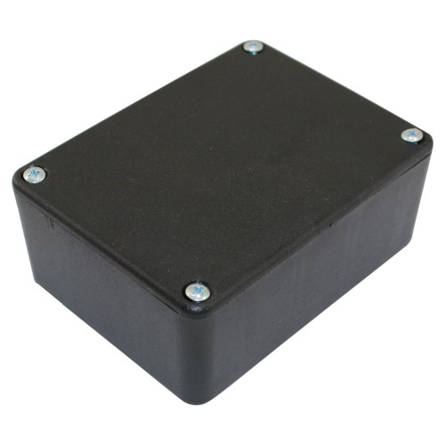
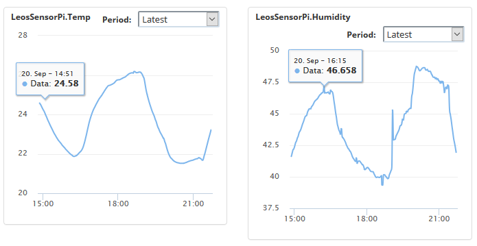

# Raspberry Pi Sensor Box Workshop

My upcoming workshop will cover the Raspberry Pi.  
You will build a Raspberry Pi sensor box. The sensors upload data to the Internet on a regular interval and you can see graphs of the sensors like the image below.  
You will learn Linux, Python and some electronics. Some fun and valuable skills that you can bring to other projects!

# Registration
Please use the parts calculator to select your parts
Due to needing to order parts, I will first accept payment for the workshops, then wait for parts to arrive and set a date.

## Parts Selection
Select parts below to calculate cost.

<form class="pure-form" id="parts-form">
    <label for="sensors-parts" class="pure-checkbox">
        <input type="checkbox" id="sensors-parts" class="required-item" price="60.00" value="" checked="true" />&nbsp;Ambient Light sensor, BME680 environment sensor, Qwiic I2C cables and connector. (required) - $60</label>
    <label for="enclosure" class="pure-checkbox">
        <input type="checkbox" id="enclosure" class="required-item" price="5.00" value="" checked="true" />&nbsp;Enclosure (required) - $5</label>
    <h4>If you have your own Raspberry Pi, you can bring your own.</h4>
    <label for="raspberry-pi" class="pure-checkbox">
        <input type="checkbox" id="raspberry-pi" checked="true" price="45.00"/>&nbsp;Raspberry Pi 3 A+ - $45</label>
    <label for="raspberry-pi-power" class="pure-checkbox">
        <input type="checkbox" id="raspberry-pi-power" checked="true" price="19.00"/>&nbsp;Raspberry Pi Power Supply - $19</label>
    <label for="micro-sd" class="pure-checkbox">
        <input type="checkbox" id="micro-sd" checked="true" price="8.00"/>&nbsp;16GB micro Sd card for Raspberry Pi - $8</label>
    <h4>Optional Loudness sensor for sound level.</h4>
    <label for="loudness-sensor" class="pure-checkbox">
        <input type="checkbox" id="loudness-sensor" checked="" price="25.00"/>&nbsp;OPTIONAL - Loudness sensor (microphone) and extra Qwiic cable - $25</label>
</form>
## Total Price (Includes workshop fee)
<h3>$0.00</h3>
### Bank Details
BSB: 06 2692  
Account Number: 4013 2258
Name: LEO WILLIAM FEBEY

## When?
Hopefully everyone will have registered in the next week. Parts can take up to 4 weeks to arrive (coming from the US). So estimated date: late Oct-early Nov 2020.  

### The sensor box consists of:
#### BME680 Environment Sensot
* Air Pressure (hPA)
* Temperature (-40C to 85C)
* Humidity- 0% to 100%
* Air quality (CO2, etc) 

#### Ambient light sensor
* VEML6030

#### Sound sensor
* Qwiic Loudness sensor

## Sign Up
<a href="javascript:;" onclick="ml_webform_1753848('show')">:fa-hand-pointer-o: Click here to join our mailing list!</a>  
Join the Discord server to chat with other participants and myself. Also sign up for the mailing list to get emails about future workshops.  
[Join our Discord server!](https://discord.gg/GQGh9UU)  