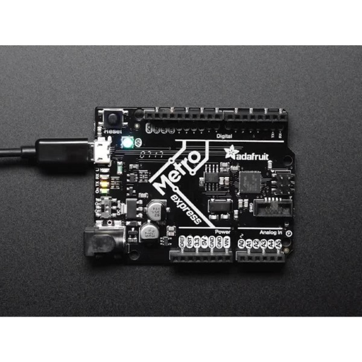
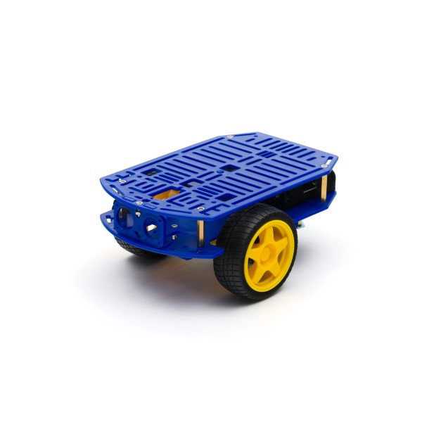
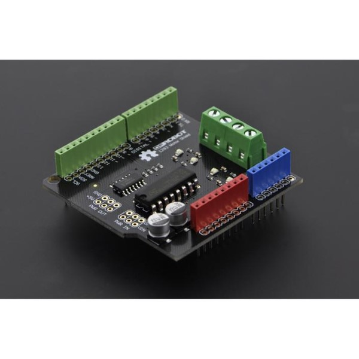
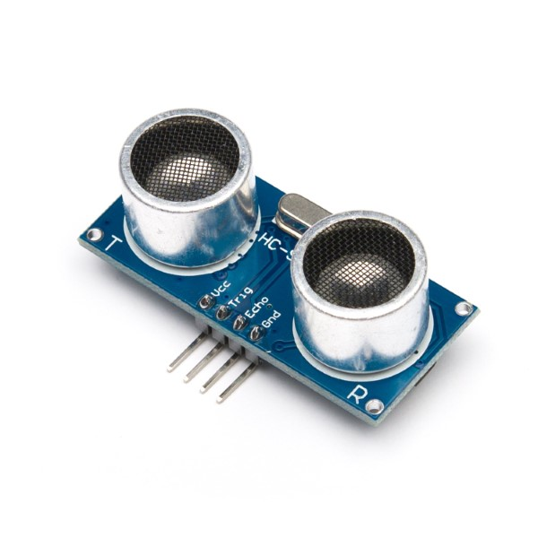
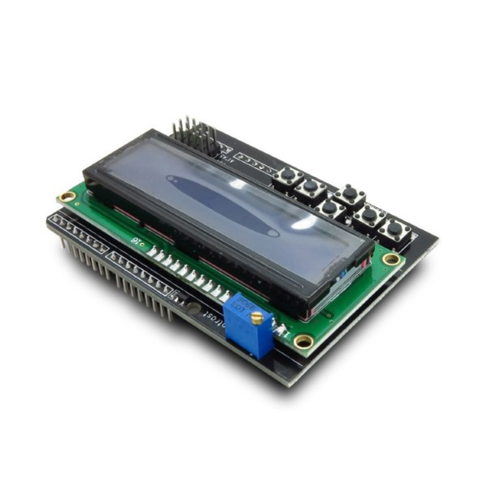

# Robot Workshop - CircuitPython (beta)

This is my first public workshop! Doesn't mean that it won't be any good :P 
I have taught children how to use the Godot Engine and I have years of experience helping people face to face, so I should be able to bring that experience to this.

My plan is to teach Python and basic robotics using [CircuitPython](https://circuitpython.org/) and a compatible development board eg the Adafruit M0 or M4 Express.

You'll be able to build your own robot, program it and take it home.

I'm aiming to target this workshop at people of all ages who have limited programming skills but want to learn a bit more. More advanced workshops will likely come in the future!

The estimated cost will be around $150-300, depending on final parts selected and content in the course. I'll send a poll around once you sign up to see what parts you want to have on the robot.

## ORDERING PARTS AND REGISTRATION

See table below for full components pricing

<table class="pure-table">
    <thead>
        <tr>
            <th>Part</th>
            <th>Price</th>
        </tr>
    </thead>

    <tbody>
        <tr>
            <td>Adafruit Metro Express M0 Dev Board (essential)</td>
            <td>$51</td>
        </tr>

        <tr>
            <td>Robot Chassis</td>
            <td>$36</td>
        </tr>

        <tr>
            <td>Motor Controller Shield</td>
            <td>$19</td>
        </tr>
        <tr>
            <td>Ultrasonic Sensor</td>
            <td>$2</td>
        </tr>
        <tr>
            <td>Standoff and Screws</td>
            <td>$1</td>
        </tr>
        <tr>
            <td>Rechargeable AA Batteries (Can BYO)</td>
            <td>$20</td>
        </tr>
        <tr>
            <td>Workshop Fee</td>
            <td>$40</td>
        </tr>
        <tr class="pure-table-odd">
            <td>Total</td>
            <td>$169</td>
        </tr>

    </tbody>
</table>

### Price Including Batteries: $169
### Price Not Inc. Batteries: $149
### Microcontroller Only: $91

### Optional Parts
These won't strictly be covered in the workshop, but feel free to add them to the total cost:

<table class="pure-table">
    <thead>
        <tr>
            <th>Part</th>
            <th>Price</th>
        </tr>
    </thead>

    <tbody>
        <tr>
            <td>ITEAD Arduino LCD shield</td>
            <td>$11</td>
        </tr>

        <tr>
            <td>Line Sensor</td>
            <td>$5</td>
        </tr>
    </tbody>
</table>

### Registration
1. Email me with your selected parts - leofebey@gmail.com
2. Register on Eventbrite - [Eventbrite](https://www.eventbrite.com.au/e/leos-robot-workshop-tickets-100352354594)
3. Send payment for workshop

### PAYMENT OPTIONS
Choose any of the following

#### 1. Bank Transfer - PayID
Send to 0427460504

#### 2. Bank Transfer - Bank Details
BSB: 067000
Account Number: 1060 5932

#### 3. Paypal
Send to overclockedamiga@gmail.com

<a href="javascript:;" onclick="ml_webform_1753848('show')">:fa-hand-pointer-o: Click here to sign up to hear more!</a>

Note - this sign up does not register you for the event.

The workshop will be held at Hobart Enterprize, 24 Davey Street, Hobart. Probably on a weekend. Parking can be tricky, but there's a lot of space inside and I'm getting the space for free!

These workshops wouldn't be possible without the support of [Hobart Hackerspace](https://www.hobarthackerspace.org.au/), [Hobart Makers](http://hobartmakers.com/) and [Enterprize](https://enterprize.space). Please check them out, they are good people!

A portion of the profits of this workshop will be donated to Hobart Hackerspace and Hobart Makers as they have helped promote the event and support me in general.

### The robot kit I currently plan to use will likely have these parts:

## Microcontroller - Adafruit METRO M0 Express

## Chassis - "Robot Chassis with 2 wheels" - Littlebird

## Motor controller shieled - 2x1A DC DFRobot shield

## Ultrasonic sensor - HC-SR04 (very popular, very cheap)

## (Optional) LCD shield
