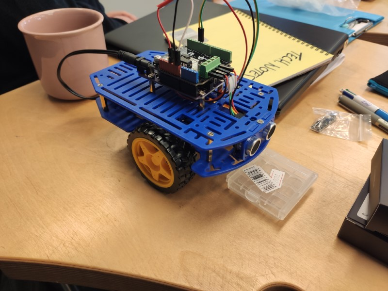
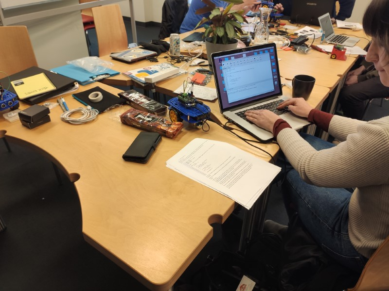
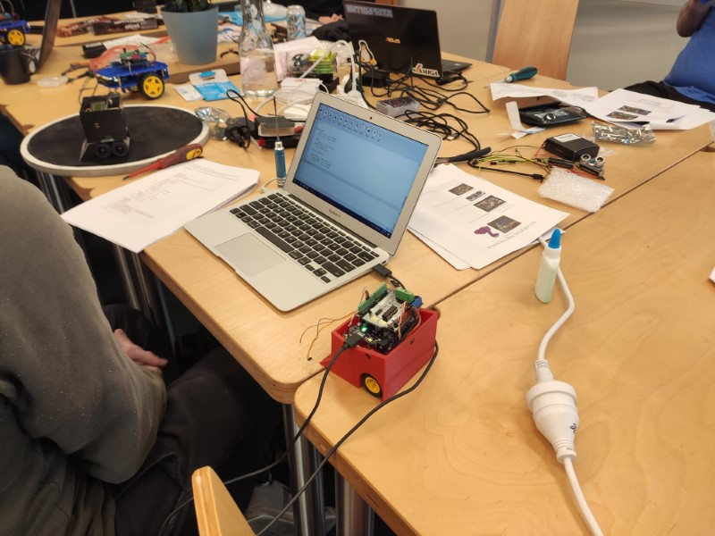
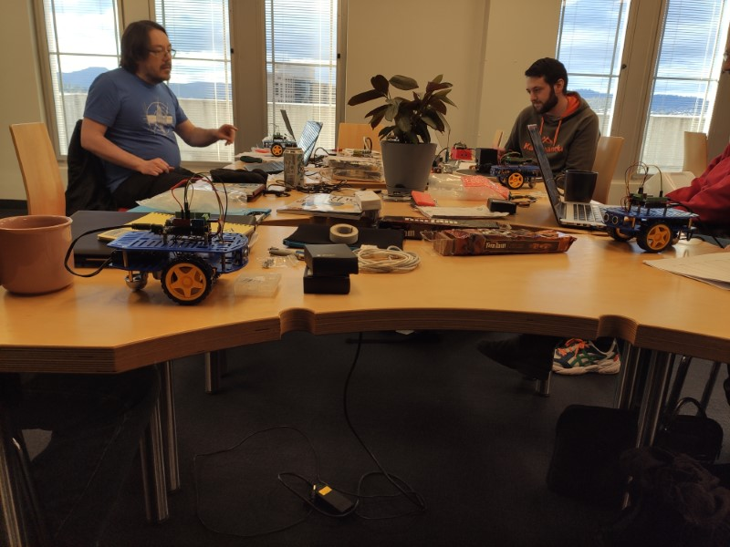
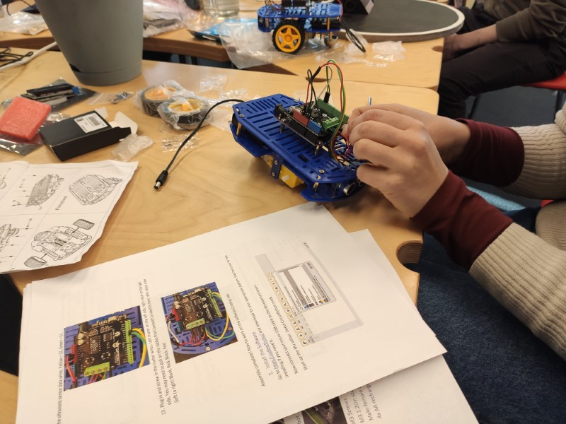
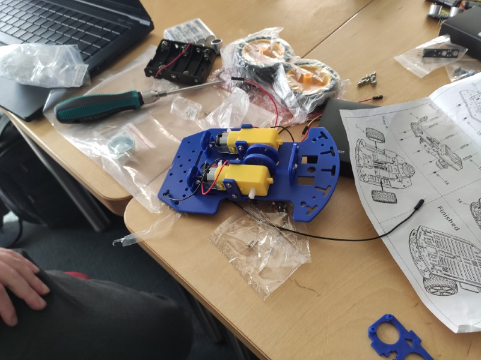
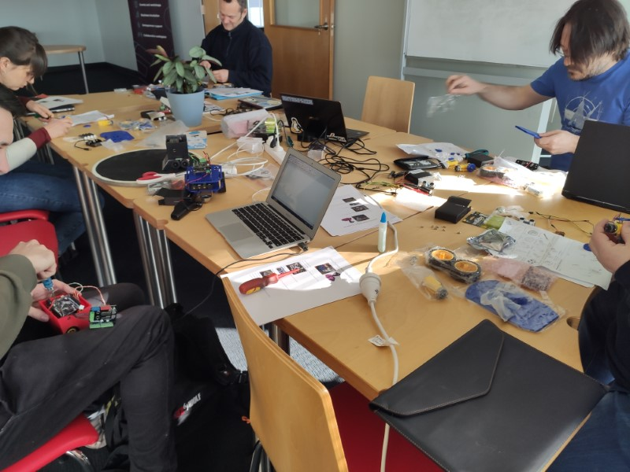

# Robot Workshop - CircuitPython

## About
This workshop first ran on 5 July 2020 at Enterprize Hobart. It covered building and programming a Python robot with an ulltrasonic sensor that avoids obstacles.  
It was a successful workshop! All participants built their robots and programmed them. I receieved good feedback.  
The cost of the workshop was arount $180 including parts and workshop fee.  
I may run another of this workshop in the future, but the next workshop after this will likely cover a different topic.

## Stay in touch
Join the Discord server to chat with other participants and myself. Also sign up for the mailing list to get emails about future workshops.  
[Join our Discord server!](https://discord.gg/GQGh9UU)  
<a href="javascript:;" onclick="ml_webform_1753848('show')">:fa-hand-pointer-o: Click here to join our mailing list!</a>

## Completed robot

## Photos
  
  
  
  
  
  

