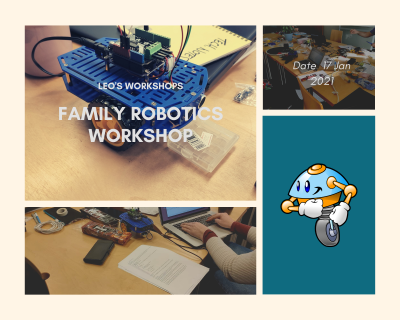
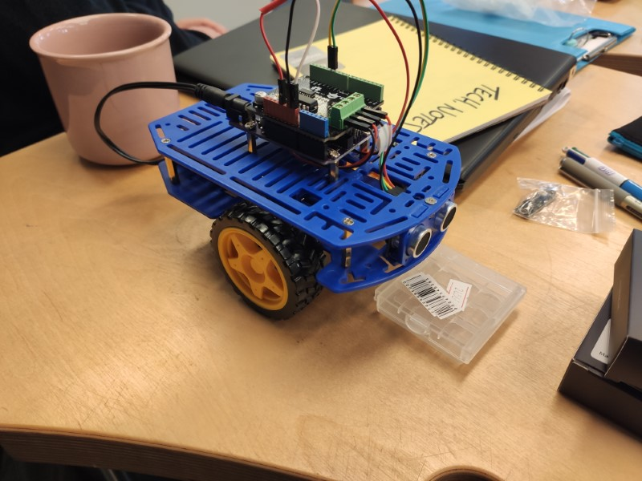
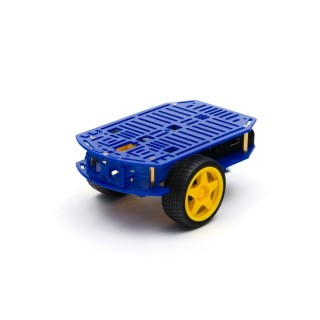
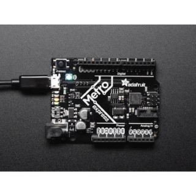
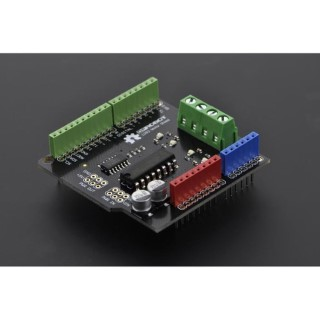
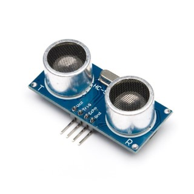

<script>
    var ml_webform_1753848 = ml_account('webforms', '1753848', 'a8z2u6', 'load');
    ml_webform_1753848('animation', 'fadeIn');
</script>
# Family Robot Workshop - CircuitPython / MakeBlocks
  
  
This 2020/2021 school holidays, I will be running a robotics workshop for kids and parents!

The key difference about this robotics workshop is that you will build a real robot with real electronics components, and also learn Python (or MakeBlocks if you prefer).

I ran this workshop earlier in the year for people of all ages, and it was very successful!

## Registration
Please register on Mixily here: [https://www.mixily.com/event/2386442204660062884](https://www.mixily.com/event/2386442204660062884)

## Date and time
Date is Sunday the **17th Jan 2021 - 11AM onwards**.  
Finish when you are ready - I am happy to stay as long as you need.
Tea, coffee available. Snacks available with small fee. Lunch not provided.

## Location
**Hobart Hackerspace - 2 St Johns Ave, New Town 7008**  
A deviation from the normal venue, Hackerspace has just enough space for 6-8 people doing a workshop. Plenty of parking, and the back door will be open from 11AM onwards.

## Cost
Cost is **$215** including workshop fee.

## Payment Details
Payment can be made before **11 December 2020** to:  
BSB: 062 692  
Acct Number: 4013 2258  
Amount: $215  

## Subscribe to my mailing list to get updated!
To be first to hear about the workshop, please subscribe to my mailing list.
<a href="javascript:;" onclick="ml_webform_1753848('show')">:fa-hand-pointer-o: Click here to join our mailing list!</a>

## The Robot


## The robot consists of a  
### Robot chassis (you build yourself)

### CircuitPython microcontroller board (Adafruit Metro M0/M4 Express)

### Motor controller (powers the motors)

### Ultrasonic sensor for collision detection. (HC-SR04)


## Python
You will learn some simple Python programming. An example:
```Python
import time
time.sleep(2)
print("Hello World!")
```