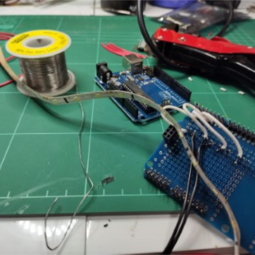

# Electronics Development
I can design and assemble electronics projects for people.  
I have been interested in electronics since I was about 6 years old. My parents bought me several kits, which I assembled. And I have soldered kits before I was 10. I'm particularly skilled with the Arduino platform. I also know AVR, XMega, STM32, ESP430.  
I have worked on several projects in the last few years, including PCB design and microcontroller programming.

## Examples of work
* CSIRO GPS tracker - I programmed the chip and designed the circuit board
* Arduino robotics - I made an obstacle-avoidance robot
* Raspberry Pi telepresence robot - As featured in my projects
* LED strober - Flashes LED strips at different frequencies. Bluetooth control. 

## Pricing
I am fairly relaxed with pricing, due to low competition. **Pricing is negotiable**, depending on the project.  
Base rate:  
### **$50 per hour** (plus electronics costs) *(see note below)

  
(Pictured above is a WIP project that I made for someone)

## Electronics skills
* Ohms law - voltage, current, resistance
* Schematic symbols
* Knowledge of most components - resistors, capacitors, transistors, ICS, regulators, LEDs, coils, photodiodes, etc
* PCB design with KiCAD
* Prototyping with breadboards and protoboards

## PCB Design
Yes, I can design PCBs! I use KiCAD. It's free and open source, but it's used by CERN so it's definitely powerful enough.  
For manufacture, I usually use one of the cheapest providers available. I can also use an Australian/NZ service if you need the PCBs sooner.

## Electronics Equipment I own
* Good soldering iron (temperature adjust)
* Multimeter with capacitance, frequency
* Digital signal analyser - Saleae Logic 4
* Various components - resistors, capacitors, buttons, protoboard, wire, LEDs, transistors, regulators, displays, and more
* Breadboards and lots of breadboard wires
* Solder sucker (Desoldering)
* Good wire stripper

## Equipment I have access to (via Hackerspace/makerspace)
* Oscilloscope
* Variable power supply
* SMD rework station
* Small 3D printer
* Laser cutters

## Microcontroller Development IDEs experience
* Arduino IDE
* STMCubeIDE for STM32 (Eclipse)
* Atmel Studio for AVR
* CCStudio for MSP430
* PlatformIO for Arduino, AVR, etc

### Further pricing notes
If you work for a business or organisation with limited funds (eg. CSIRO) I can offer my services at a lower rate. 

### *Why charge so low?
* I really enjoy electronics projects
* I don't get a lot of them, so they don't pay the bills
* No local competition - don't feel bad for undercutting anyone's services
* A lot of electronics is soldering, cutting wires, and usually a quick bit of programming, so the work is rather spaced out.