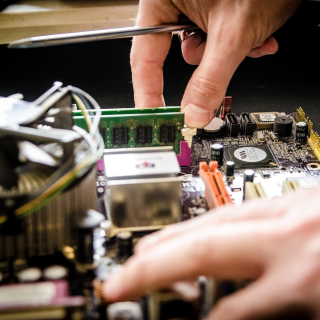

# Computer Repair

Is your computer simply not working, or behaving badly? 

I have experience successfully fixing computers that present black screens, won't charge, won't get past boot logos, behave badly, etc.  

## Fixed PCs Examples
* Computer switching off after a while - dust build-up - cleaned out dust
* Blue screen of death - update drivers, isolate and replace faulty hardware (RAM, graphics card, hard drive)
* Unwanted toolbars, browser start page and random popups - symptom of a virus or spyware on your computer - I can remove them
* Computer needs resetting (for whatever your reason) - reinstall Windows OS

