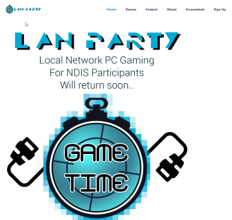

# Web Development and Design
I know all of the aspects of getting a website up and running on the Internet. I have made two websites so far (this included) and keen to keep going. I can provide a basic Wordpress or Grav Content Management System*. I can also offer a more custom solution. 

## Other website(s):
[Game Time LAN](http://www.gametimelan.com)  

## Web skills
* HTML5
* Javascript
* CSS3
* PHP
* Wordpress
* Grav (this website)
* NodeJS
* Python Flask
* Web hosting
* Domain name registration
* Linux

## Pricing And Packages

### Package 1: Basic Website with Customisable Pages and Blog
I can set up a basic Wordpress website with a design that is visually appealing and with the ability for the customer to add pages and make blog entries.

***Note:*** I have limited experience delivering Wordpress websites - but I have very similar experience with this website, Grav. I'm confident that I can make a good Wordpress website.

As such, I can offer a lower price than others!

#### Introductory Price: $600
***Note:*** This does not include yearly hosting and domain registration fees, these will be invoiced to you. Typical costs is about $75 per year.

### Package 2: Website with Shopping Cart
As above, I can set up a website with a shopping cart. Depending on circumstances, the website may need to be a Grav website. Which is still quite usable for people with no programming experience, but perhaps not as full-featured as Wordpress. But it will include a shopping cart feature so customers can shop.

#### Introductory Price: $800
***Note:*** This does not include yearly hosting and domain registration fees. These will be invoiced to you. Shopping cart sales will use your bank account. Typical yearly cost is $250 (mostly shopping cart service fees).

### Package 3: Simple Website without Blog
If you don't need a blog, this reduces development time a bit. If you are just advertising yourself or your business, I can provide a simple website in short time.

#### Introductory Price: $450
***Note:*** This does not include yearly hosting and domain registration fees, these will be invoiced to you. Typical costs is about $75 per year.

### Other Options - Custom Solution
If you need something a bit more custom, like a website that connect to external data sources, I am happy to talk. I have experience with Python Flask, which opens the doors to many solutions. 

#### Introductory Hourly Rate: $60 per hour
***Note:*** This does not include yearly hosting and domain registration fees, these will be invoiced to you. Typical costs varies depending on server requirements, but can range from $150 up to $700 per year.

## *What is a Content Management System?
A CMS is software installed on a webserver that lets the web administrator (you and me) easily control the content of their website. It typically does not require any web development skills such as HTML, CSS, Javascript. You just need to be able to write content, upload images, etc. This means that once I'm done setting up the website for you, I can hand it off to you, so you can adjust content in the future if you wish. No need to come back to me to alter content.

## Technologies that I am keen to learn if needed
I am a very quick learner. These technologies shouldn't take too long to learn, and I won't charge for time learning.
* Flutter (currently learning)
* Angular
* React
* React Native
* Django
* Ruby on rails

*Note:* I am not a graphic designer and have less than average abilites to implement a professional custom design. However there are a lot of decent pre-made designs that I can utilise.