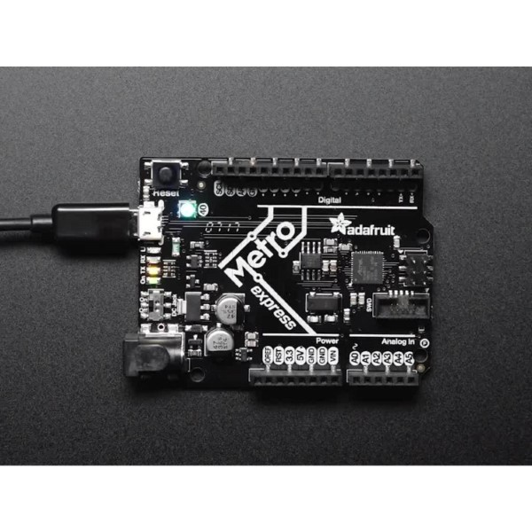

# Robot Workshop - CircuitPython (beta)

This is my first public workshop! Doesn't mean that it won't be any good :P 
I have taught children how to use the Godot Engine and I have years of experience helping people face to face, so I should be able to bring that experience to this.

My plan is to teach Python and basic robotics using [CircuitPython](https://circuitpython.org/) and a compatible development board eg the Adafruit M0 or M4 Express.

You'll be able to build your own robot, program it and take it home.

I'm aiming to target this workshop at people of all ages who have limited programming skills but want to learn a bit more. More advanced workshops will likely come in the future!

The estimated cost will be around $150-300, depending on final parts selected and content in the course. I'll send a poll around once you sign up to see what parts you want to have on the robot.

<a href="javascript:;" onclick="ml_webform_1753848('show')">:fa-hand-pointer-o: Click here to sign up to hear more!</a>

Note - this sign up does not register you for the event.

The workshop will almost certainly be held at Hobart Enterprize, 24 Davey Street, Hobart. Probably on a weekend. Parking can be tricky, but there's a lot of space inside and I'm getting the space for free!

These workshops wouldn't be possible without the support of [Hobart Hackerspace](https://www.hobarthackerspace.org.au/), [Hobart Makers](http://hobartmakers.com/) and [Enterprize](https://enterprize.space). Please check them out, they are good people!

### The robot kit I currently plan to use will likely have these parts:

## Microcontroller - Adafruit METRO M0 Express

## Chassis - "Robot Chassis with 2 wheels" - Littlebird

## Motor controller shieled - 2x1A DC DFRobot shield

## Ultrasonic sensor - HC-SR04 (very popular, very cheap)

## (Optional) LCD shield
