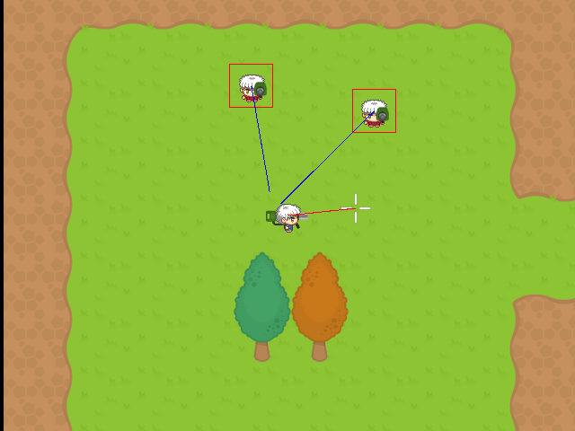
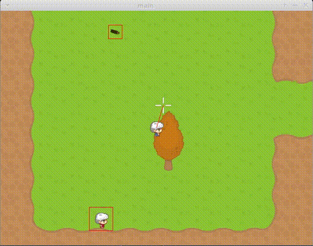

# 2 Years of Working On My Game, Wizards with Rockets

It as been a little bit over 2 years since the first Git commit of my game. The first commit was on the 11th of April, 2018. I had been recovering from a mental illness. In that time I came up with several creative ideas, including this game. It was a good activity to do, to keep my mind pushing forward.

Originally, I had intended the game to be a multiplayer-only game. But I realised that most people won't be able to set up a multiplayer game, but they will be able to give it a test in single player mode.

In late 2018 I completed a public demo multiplayer test - where two games on two machines were communicating with each other. Actions of each game were updating on the other game! It was a bit laggy, unfortunately. And there were some bugs - like not being able to damage the other player. But I was pretty happy that it worked :)

In 2019, I shifted to working on single player (including checkpoints, end level collider, level changing, score), HUD (health, lives, score), GUI (main menu, in-game menu, cursor), bug fixes. Just in April 2020, I have completed a single player build with full-functionality.

2020 looks to be a very exciting year for this game. I'm going all-out and adding some big features. Like physics, scripting, new advanced GUI, new graphics, bringing multiplayer back. I'm not sure if I'll complete it all in time for a Steam release before the end of the year, but I'll try.

You can see a list of features I will be working on on my public Trello page: [https://trello.com/b/Qa0mmSMV/wizards-with-rockets](https://trello.com/b/Qa0mmSMV/wizards-with-rockets)

It has taken a while to get to this stage because development is SLOW. Progamming in C, debugging, compiling, adding feature seen in other game engines (like Godot). It's a lot slower than if I had picked a more sensible, feature-rich engine like Godot, Unity, LibGDX, Love2D, etc. Plus I have been fortunate that I have had some major contract work (especially in 2019).

Despite the slow progress, I have really been enjoying working with C and Allegro. It is letting me have a lot of control over my game, adding any (available) libraries - like dyad for networking, tmx renderer for maps, config file parser, and future features. I'm having a real sense of ownership with my game. Plus, I have a guilty pleasure for programming in C. It's just rather satisfying to write code that compiles to a native binary executable file. Unlike other engines - where you write interpreted language that runs on top of a massive pre-compiled engine. Theoretically, I can port my game to many platforms, including some consoles (like Nintendo Switch and PS4 - not sure about Xbox..).

The progress so far has been slow and a bit un-exciting. But I've built a solid framework for building upon, and the next year or so will see some very exciting features added! :)

Jan 2020

Feb 2019

June 2018

