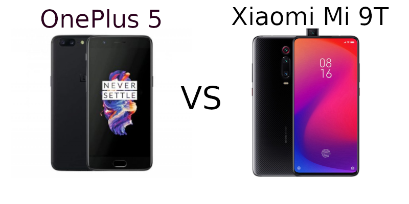

# Android Phone Battle - Xiaomi Mi 9T vs OnePlus 5

I have had a very mixed experience with Android smartphones. My first smartphone was a Huawei IDEOS U8150 in 2010. It was pretty rubbish. When I bought it, I had the option of saving for a slightly better phone and getting it later. Being young (20) and living for the present, I chose to get the cheaper phone in the spirit of the moment. It was horribly slow, just opening the phone app took 15-30 seconds sometimes.  

Since then, my phones have been much better, but still a few blunders. I won't go into detail yet, but Android phones can be very hit and miss.

This post is about how Android phones can be hit or miss, it's really a gamble.. Feel free to scroll down to the conclusion to get to the point.

## Buying the OnePlus 5 in mid 2017
I had been working at a new job, earning some decent income (finally). So I thought I'd buy a decent phone to last a while. My phone at the time was not a super great phone, a UMI Super (2016). It was nice on paper, but in person it was quite disappointing (eg, the camera was an utter embarrassment).
I vaguely remember picking between a few phones. What stood out was the very-close-to stock Android experience. I had previously had a Nexus 4 which I loved to bits, but was getting a bit outdated by then. The OnePlus was a whopping $800 AUD at the time, much more than I'd ever spent on a phone. But I thought I'd get it and just live with it for 3-5 years. It would save me from buying a new phone sooner.

### Initial Impressions of OnePlus 5
Compared to the UMI Super it had some major strengths:
* Much better camera - no more dodgy photos
* NFC for tap and pay
* Super snappy performance - the UMI wasn't terrible, but this was close to perfection
* Better vibration motor
* Better build quality and design (very iPhone-like)
I was pretty happy with it but I don't think I truly apprecited it until recently.

## (Accidentally) Killing the OnePlus 5
Unfortunately, one issue with the OnePlus 5 was that the USB-C port wore out within a year or so. So when plugging in a USB-C cable to charge it, the connection was very unstable. It would sometimes not charge overnight. A bit of a problem. So I bought a new USB-C connector to replace it. When taking it apart, I used metal tweezers to pull tabs apart and stuff. Unfortunately, my tweezers touched some metal contacts on the OP5's mainboard and caused a small spark. When I put it all back together, it wouldn't turn on :(. I had just killed my $800 phone.. Time to buy a new one :/

## New phone - Xiaomi Mi 9T
I didn't want to spend another $800 or so on a new phone as it was a bit too much to spend on a phone after just 2 years. So I was looking at mid-range phones. I figured they would be about the same overall quality as my flagship 2017 phone. A lot of phones were going with tall-screens. I liked it, but I didn't like the holepunch cameras. They take up valuable notification bar space. So the pop-up camera on the Xiaomi Mi 9T appealed to me. I had heard about in-screen fingerprint readers from a while before, and thought it was a pretty exciting concept. So that was another cool point. The Xiaomi was about $550 AUD so I thought that was a pretty fair price for those features. I bought it thinking it would be a pretty good side step from my OnePlus. Not hugely better, but not any worse. Living with it for a year was pretty good, except for a few issues (will explain later on).

## OnePlus 5 comes back to life
I was thinking about my OnePlus 5 for a few reasons. My Xiaomi had stopped working with tap and pay. And I had a few less than ideal camera shots over time. So I thought I'd prioritise buying a replacement mainboard. Out of curiosity, I pulled my OnePlus 5 out of storage. I pressed the power button. It turned on!! Technology is weird. It still surprises me today with it's un-predictableness. No idea why it came back to life, perhaps a capacitor discharged? My old phone with all of it's apps came back online. Some even still worked, like Facebook despite not having an update for over a year.

## Switching back to OnePlus 5
I had wrote up a list of reasons why the OnePlus 5 was a little bit better. Things like
* Working tap and pay payments

* More consistent camera quality

* Better AMOLED screen quality

* Thinner and lighter

* Stock Android

  I thought I'd switch back to it just to compare the two.

### Some other bonuses of the OnePlus 5
Since switching back, I noticed some other improvements. Things like:
* Louder earpiece speaker (the Xiaomi was very quiet)
* Much snappier performance - probably due to stock Android
* Much quicker to open and unlock - face detection and front fingerprint reader are much quicker
* Slightly easier to type on
* Considerably lighter and thinner - makes for a more enjoyable experience
* Notification content when locked
* Vibration motor is much better - feels more responsive
* The Xaiomi has two main display modes: dull or oversaturated, the OnePlus has sRGB, DCI-P3 and others. I find the DCI-P3 mode to be the best balance. Similar to Apple's True-Tone. So the OnePlus has a much better display.

## Conclusion: Newer != Better
Android phones are made by many different manufacturers who all have different approaches to quality in different areas. Xaiomi is a Chinese brand, much like the UMI Super that I bought. It is night and day better than the UMI Super, but still fails in a few areas compared to flagship phones from a few years ago. Like earpiece volume, working tap+pay, screen quality, camera quality. Consider it a warning when buying some Chinese brands, they may have a different approach to quality vs other brands. I can't really recommend upper mid-range Xiaomi phones to people any more. But I don't know what phones to recommend, as I can't test them all! I guess try to spend as much as you can on a phone. Spending over $600 will likely guarantee you will get a phone that will be good and last a few years. Spending less than that, it may only last 2 years or so before you wanting another. I'm a bit of a perfectionist though, I can't help but see the quirks in things. Some people may be happy with budget/midrange phones until they break or wear out. Remember to read reviews, that helps too. I don't want to say, just buy an iPhone. We should be able to have a decent enough phone for much less than the cost of an iPhone. And you can. 

### Avoid
Personally I'd stay away from Samsung (due to it being overpriced). Huawei (due to the Google Play store uncertainty). And other cheap Chinese brands (Oppo, realme, TCL, etc). Xiaomi can make some nice more expensive phones, but I'd avoid their midrange. Also, you mostly have to buy them from China, with no warranty.

### Consider
OnePlus, LG, Pixel 3a/4a, Nokia, Motorola, Sony. These look like they have some pretty good options. If I were buying a phone, I'd consider:
OnePlus Nord, Pixel 4a - if I was on more of a budget
OnePlus 7T/Pixel 4 - if I had more money to spend (Last 5 years or so).

Nokia if you're on a super tight budget. My parents have Nokia phones and they seem ok.

I love Sony's design but they are so hard to find in Australia. Also a bit expensive it seems. Bring back Sony!!

You can get OnePlus from Kogan in Australia, and Pixel from JB Hifi. 

### The Elephant In the Room: iPhone SE

It's a miracle, Apple have released a sub-$800 AUD phone that doesn't suck. But it still has a tiny 4.7" screen, much smaller than the 6" or so on a majority of Android phones now. I have to say, I would be considering it, but I am more of an Android fan. Maybe something like it for my next phone in 2022 or so.

## Pros and Cons of each phone
### OnePlus 5 Pros
* **Tap and Pay works**
* **Closer to stock Android**
* **Snappier performance**
* **Much louder earpiece volume**
* Better OLED display quality (less over-saturated)
* Better GPU - up to 2x better (despite being 2 years older)
* Better screen aspect ratio for gaming
* Front-facing notification LED
* Quicker unlock
* Notifications content on lock screen
* Thinner and lighter - feels much nicer
* Much better vibration motor
* More network bands - good for travelling (when we can again)
* More RAM - 8GB vs 6GB
* More custom ROM support
* Silent mode physical switch
* Still has Android 10 official update
* Faster storage - 700MB/s read (vs 400MB/s on Xiaomi)

### Xaiomi Mi 9T Pros
* **Ultrawide camera** - larger field of view
* **Full screen** - bigger display in similar footprint
* **In-screen fingerprint reader**
* **Built-in night mode**. It still requires you to stay still, but it's easier than the OnePlus to use.
* Will likely get Android 11 before OnePlus 5
* Popup camera (cool show-off feature)
* Slightly better battery life (but could be better still with stock Android)
* Better slow-mo camera (more FPS??)

### OnePlus 5 Issues
* Unsure if/when Android 11 update
* Still needs to be in a case because it is slippery
* Slow-mo camera not as good as other flagship phones
* No ultrawide camera - now available on midrange
* Battery life isn't amazing, but isn't terrible
* May have to replace the USB-C port again
* Camera not as good at low-light, but can kinda achieve good results with the Pro mode (but is tedious to get right)

### Xiaomi Mi 9T Issues
* **Tap and Pay does not work** (tried different settings)
* **No SMS notifications on Amazfit Bip** smartwatch with default SMS app
* **Very quiet earpiece speaker**. Some calls were difficult and frustrating.
* Hard to take apart and replace the battery - requires a heat gun
* Screen colour accuracy isn't as good as the OnePlus - slightly oversaturated
* The notification LED hardly ever gets seen, it is almost pointless
* Not as snappy as the OnePlus 5 - probably due to UI bloat (and maybe SSD speeds)
* Vibration motor feel is much worse. This is something that is very poor on Android, but the OnePlus does it well.
* MIUI - it's not really my cup of tea. I am a stock Android fan. Deviating too far from stock Android starts to feel alienating. Sony does it well.

## Things I'd like in my next phone

* Night mode for camera - comparable to the Pixel phones
* Ultrawide camera
* 480FPS slow mo (I hardly ever use it, but it's a cool toy)
* WiFi 6
* 5G
* Close to stock Android again
* Pop-up camera if full-screen (likely)
* An improvement on GPU performance (not a step back)

### Closing Note

I mostly wrote this for my own justification, and also to inform people about the fact that Android phones can be very hit and miss. It's kind of a promotion for OnePlus, and a criticism of Xiaomi. But OnePlus is still rather expensive, and Xiaomi can be ok, but I'm picky. The nice thing about Android is that you have a lot of options for different price points. And you don't need to spend over $800 to get a phone that will deliver a good experience. Just remember with Android, try to get the best quality at an affordable price. Don't cheap out if you can help it! And read reviews.

