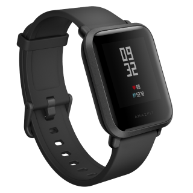
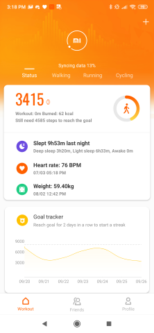
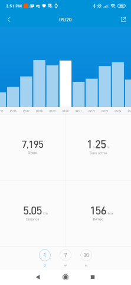
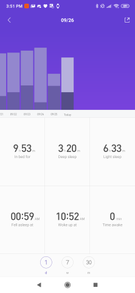
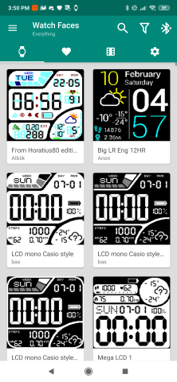
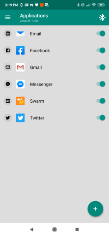

# The Best Smartwatch You Can Buy (In My Opinion) (And That's Not A Great Thing)

To cut to the point, it is the Xiaomi Amazfit Bip. No, not the Apple Watch.

Watches have historically had very long run times before they needed to replace the battery or wind the spring. 

## Sleep Tracking
Smartwatches and smart bands have been incorporating a useful feature, sleep tracking. Sleep is very important for mental and physical health. Being able to track your sleep helps you to know how well you are sleeping, and how well you are overall.

Sure, you could have a smartwatch and a smart band, but that just makes life more complicated. And it's not a great look for some people.

Most modern, more advanced smart watches only last about one or two days, which makes sleep tracking very difficult.

## Charging
Even without sleep tracking, having a fiddly extra thing to charge makes life more complicated. Also, the band can wear out more quickly as you remove and strap on the watch every day. There haven't been many smartwatches that have an elegant way to charge them. I had an LG Watch Style, which had wireless charging. Sounds good, but the proprietary dock had a rather short cable, and the watch would easily fall off the small dock. Apple Watches have a slightly better wireless charging dock, but you still have another awkward device to charge regularly. I will admit the Amazfit Bip doesn't have the best charging dock - it's a physical metal contact and it clicks into an inset of the watch shape. But, I only have to charge it every few weeks.

## OS Compatibility
Apple Watches are pretty cool, but they are only supported on iPhones. Quite a lot of people have Android devices, so Apple Watches are not available to a large percentage of smartphone users. Wear OS (Google's alternative) is even supported on iOS (although not as good as Android good I hear). Mi Fit (the app that runs with Xaiomi Amazfit smartwatches/bands) also runs on iOS.

## Screen
One of the components that make the Amazfit Bip have such great battery life is the colour e-paper display. It is able to display it's contents without needing a power-hungry backlight (or OLED display). It also makes it easy to read in sunlight and brighter rooms. It is rather disappointing that this technology isn't used more in smartwatches, such as Wear OS watches, Fitbit, etc. However, there was an even better screen technology which seems to have disappeared from the market completely. I had a Sony Smartwatch 2 smartwatch. It had a transflective display. This allowed it to have a black and white screen when it was idle, a full-colour screen in daylight and a backlight. The Sony Smartwatch 3 also had this screen. However it had an older chip running Android Wear and the battery life was only a little better than other Android Wear smartwatches.

## Features
The Amazfit Bip doesn't have as many features as a similar watch (Pebble Time) but it has just enough to be compelling.

Features
* Notification mirroring
* Custom watch faces
* Inbuilt fitness tracker
* Sleep tracking
* Heartrate monitor
* Low-colour sunlight-readable reflective screen
* Alipay (exclusive to China I think)
* Compass
* GPS

## App Screenshots

### Mi Fit

### Mi Fit - Steps

### Mi Fit - Sleep Tracker History

I have purchased an addon app for the Amazfit Bip (and for other Xiaomi smartwatches/bands), 
[Amazfit Tools](https://play.google.com/store/apps/details?id=cz.zdenekhorak.amazfittools&hl=en_US). It has several useful features such as:
* Watch face browser
* Button mapping - press button n times to trigger things like volume, track playback
* Notification mirroring

### Amazfit Tools - Watch faces

### Amazfit Tools - Notifications

## Amazfit Bip Cons
The Amazfit Bip is as said, only just the best smartwatch. It is dearly missing some features that would make it a much better product:

* Volume control buttons! - just like on a phone, be able to control the volume without reaching for phone
* Apps - Let developers have access to the hardware and they can come up with all kinds of clever and useful things. One app I miss from my Pebble Time Round is the Swarm app that let me check in to places without opening my phone.
* NFC for tap and pay payments - Not impossible to implement
* Smart assistant (Like Google Now, Alexa, Siri, etc) - This may be trciky to implement on such limited hardware, but the Pebble Time had one (allbeit limited)
* Less generic design - I personally don't mind it, but some people may find it a bit unattractive and lacking in bling.

## Summary
The Amazfit Bip is the most practical smartwatch out there, but it is still missing features. It is however very cheap (Around $100 AUD / $80 USD). However the missing features could easily be implemented at little extra (hardware) cost.

