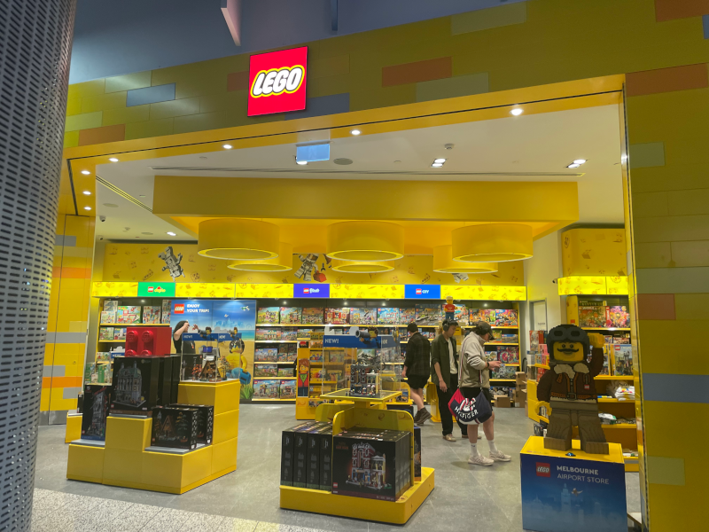

# Everything Open and Travel Bug Fix Requests

Yesterday, on March 14th 2023 I attended the Everything Open conference! Just for one of the three days of talks however. I currently can't sacrifice my income for the majority of the week of travel that would be required to attend the whole conference. I'd have to spend about a half a day before and after preparing and sleeping it off. So I decided to go for the one day, despite no doubt missing out on many good talks and networking opporunities. Oh well.  
The whole experience involved travelling by plane, which I don't do very often. I'll cover that further down, but I'll start with the good bits.

## The conference Day 1
### Background
I'm impressed by the quality put into this conference. The branding, animations of the logo, AV technical execution, choice of venue, structure of the program, website sign up process. It's an impressive orchestration. 
As some may know, this conference was previously called "Linux Conf Australia" or LCA for short. The transition into "Everything Open" I don't have the full details on, but from what I recall, the Linux Conf event disappeared due to the core team that puts forward proposals for it, not putting forward a proposal. Don't quote me on that, please do your own research, but basically there was some organisational issues, somewhat relating to the pandemic that lead to the "Linux Conf Au" branding expiring, and something else needing to take it's place. I've been to an LCA in 2017, and after being to this one, it feels very similar, maybe a slightly smaller scale, for several reasons.

### The talks
It started with an introduction from Sae Ra Germaine who nicely introduced the event.
  
The first keynote was from Hugh Blemings, giving us his life story in software development and other areas. Some important life tips about how to be a software developer and have a healthy lifestyle. Finishing off his talk with some impressive singing!  
We then had morning tea. Being about the only person I knew there except Paris BA - it was quite difficult socialising with people. Though I gave it a try and did manage to talk to one group. We chatted about what stuff we're doing. Go me!
The first talk I attended was "Cautionary Tales on Implementing the Software That People Want". My brain not being booted up yet, it took me a bit to start taking in the information properly. However I was able to recall some important tips - if you make software that's used a lot (say in the Linux kernel) any issues it has will start popping up more, the more users there are. So you might get a few issues a week, but then if say Linux becomes used more in IoT, you might get dozens per day. So get on top of those issues while you can I guess.
The next talk was an obvious talk, from Paris BA (fellow Tasmanian) titled "Let’s Use An Automated Theorem Prover To Verify Video Games; I Promise This Is Applicable To You". Where Paris gave a recap of the Mass Effect storyline for context to explain how Z3, a theorem prover library can be used to prove what conditions needed to be met in order to complete outcomes in games with branching choices, like Mass Effect. It can be used for other things, where internal logic is not transparent to the user. You can map it by knowing what conditions need to be met, then figure out the minimum conditions to succeed to complete a goal.  
  
Lunch was Paris and I hopping over to "The Boatbuilders Yar" a nice hip restarant and bar close to the conference. I had a beer and a fish burger. Not bad. A group of fellow conference peeps joined us including another presenter who gave a talk today about the issues with the COVIDsafe app. I didn't know it at the time but he has an impressive background.
After lunch, I couldn't miss a talk by Pia Andrews, the mind behind GovHack, one of my favourite hackathons. Her talk about government policy was quite important. With the government rolling out policies that affect many people, and not monitoring their issues much at all, Pia was talking about how to minimise the issues that policies create by suggesting ideas like feedback systems and software to help people navigate the complexities of these policies. Stuff that really should happen.
    
I planned to go to the next talk titled "TeX, OpenType fonts and Rust" (Rust is a very hip programming language right now). But the speaker was missing. Oh dear. So I went to the talk "How I Broke an ABI" about how an IBM employee acidentally broke the Linux kernel for 32bit Power PC and RISC V temporarily. I won't spoil it but it invovled some cool low-level programming in C.
Then there was afternoon tea. A small amount more socialising. As said, it's very difficult when you don't know anyone. But I managed again, which is a notable achievement on my part. Though travelling to the conference is an achievement as well for me. I didn't hear the Xbox "acheivement unlocked" noise the whole trip, strangely.  
The next talk, was not easy to pick but I went to the one about bikes. "The Velograph - Open Source powered bike safety". A talk about the development of an open source (or soon to be) bike data collection device. As someone who develops electronics, it was very interesting to see. Apparently you can get some of these PCB assembly places to do 3D printing as well for the chassis.  
The last talk I chose was one about "how to talk to people in cryptography" or something like that. It got changed to a talk "Enforcing Privacy Rights Against Big Tech and Big Surveillance" which was a long speech about privacy and the right to privacy. I was nervous to make sure I caught my flight in time so this one I didn't take in too well. Ah well.

### Travel and it's issues
No doubt travel has been worse during the heights of the pandemic, but I still didn't have a fun time travelling via the airports. 
On the flight out, I had an item confiscated by the baggage scanners. It was just a metallic credit card multi-tool, which had a small and blunt blade on it. It woulnd't have hurt anyone due to how blunt it was, but it got confiscated, due to protocol no doubt. Ah well, they are pretty cheap on eBay. Other than that, the process of getting on the plane in the Hobart airport was quite alright, I didn't have any issues. I was with Qantas, and the experience was pretty smooth.  
I then took my booked SkyBus into town. The SkyBus was a bit weird, no obvious sign when it was going to arrive or pointers at the collection point as to where it was going. You had to find that out yourself (which I didn't do well enough). The slightly sheepish SkyBus employee on site reassured me the bus would arrive in 10 minutes and would go to the city. It arrived, I got on, put my mask on (!!! - not many people wearing masks), and it drove me all the way into the city. I got to see how big Melbourne was, and yeah, it's a little bit bigger than Hobart. I arrived in the bus depot, inside a taller building. Found my way outside and to the trams, to take me to the conference. I could have walked, but the trams were quicker. Google Maps helped me catch the right tram to the right place. The tram was packed and I almost didn't get on due to it being so packed. Obviously a **free** thing being taken advantage of quite thoroughly. It took me just adjacent to the conference center then I found my way in. The conference wasn't advertised that well, at around 8:20am I didn't know quite where it was but eventually found it.

On the way back home, that was a living nightmare in comparison. I caught a tram, and intended to put my mask on as before the tram took off. But it took off before I was able to and almost knocked some other people over (didn't though). So I didn't put my mask on despite being like in a tin of sardines. Went back to the SkyBus terminal, but the departures out was in a different location, not too well advertised but just advertised enough with signs that I did find it. I'm so used to the Hobart way of everything being easy to find. This was not. The SkyBus took me back pretty quickly despite peak hour traffic.  
The the nightmare.. I had not idea where to go to catch the plane. I found the "departures" sign which took me up a rather un-obvious escalator. You'd think the building architects would design the place so it was more obvious where to go. As a game developer, you've got to guide the player. This building did not guide this player very well. But I started off in the right direction. I then walked a fair way to the "T3 and T4" terminals. I wasn't sure if it was the right place, so went down some more escalators to look for signage for Jetstar, which I think I did find, and went back up again. I boldly proceeded, not knowing for sure if it was the right way to my plane departure gateway. Went through the scanners, slowly put my stuff into the containers and they went through the machines fine (despite a bit of electronics being in my bags). Unlike Hobart, you are supposed to keep your laptop in you bag. I didn't know this until after I took it out of my bag and it was on it's way. It went through ok regardless. I then went through the weird body scanner. They asked me to remove my belt. I did not like having to do this. Was it really necessary? If only the engineers had figured out a way to build a scanner that wouldn't require you to remove your belt. I didn't have to do that in Hobart. My pants didn't fall down (bless) but it felt a bit humiliating. The scanner somehow picked something up on me. The security guy respectfully patted me down and let me though, it was of course a false postive. Technology is so great right? I then collected my stuff and awkwardly put my belt back on. Sigh. I looked around, and finally found my flight number on a screen. Yay! In the right place! However I didn't know where the heck to go. So I just had to explore the massive terminal space. I walked for about 5-10 minutes down a long hallway in hopes I'd find it, and I did, I saw the gateway with my flight number on it. I shouldn't have had to do this. Jetstar should have told me where I was supposed to go somehow. Email, SMS, these are some good options. Dissapointing. I also found out that the flight was delayed by an hour. Time to kill. So I looked around for something to eat. I found a LEGO shop! So I browsed for a bit and bought some LEGO. Kit 76911 - Aston Martin BD5. Only $33. I guess tax/duty free? Then went to get dinner. I found a place, "Two Johns". Which looked nice. But had some issues. The table and chair setup was a bit chaotic. Some chairs had been placed to block passage for some incomprehensible reason. So finding my way to a table was a bit of a maze, also avoiding pathways blocked by people. Found a table, and ordered using the QR code on the table. First time I tried, with Apple Pay it didn't work. I changed browser from Firefox to Safari and the order went through. Then got a beer. After over 30 minutes or so, no meal. I went to the counter to check, told them my order number and they said they didn't get it! So they tried to make it again. About 10 minutes later, the flights screen showed that it was time to head down to start boarding. Went to the counter to tell them I had to go (no meal yet) and they said they could do take-away. I said okay, if there's time. They came back and said my order hadn't been started yet again! So yeah maybe avoid that place unless it's quiet and you have lots of time to kill. Had a beer though, and they refunded me. Finally made my way to the gateway. Took about 25 minutes to start boarding. I was unsure if my boarding pass would work as JetStar had been uncommunicative with me. Scnned it, green tick! Big releif, I was on my way home. Oh, there were tons of people on that flight. So many people coming into Hobart. Who wants to come to Hobart? The tiny city. So I had to sit next to people which wasn't too bad. The "fist officer" or guy who did announcements, was sure to point out that smoking on board was a $2000 fine. So don't do that, in case it wasn't obvious. Got home, lots of people at the airport on arrival, was a bit squeezy getting out, but got out. Then went to drive out. I booked my parking but pressed the button to get a ticket on the way in. It recognised my number plate on the way in, but on the way out it asked for my ticket (second boking?) so I paid $21 for the booking,then abother $24 to get out. But did get out. Went home, grabbed some Maccas for dinner (at about 11PM). Slept 9.5 hours that night.  
  

### Airport recommendations (bug fix requests)
* You shouldn't have to remove your belt when body scanning
* False positives in body scanning suck - fix this
* Hobart Airport parking entrance meter shouldn't say press button to take ticket if you've booked your parking. Otherwise you get double charged.
* Jetstar should tell you what gateway you need to be at via SMS or email!!
* Melbourne airport should have an internal map on Google Maps, or much better signage with airline names (eg - Jetstar this way)
* Two Johns you need to fix Apple Pay orders on the QR code ordering system