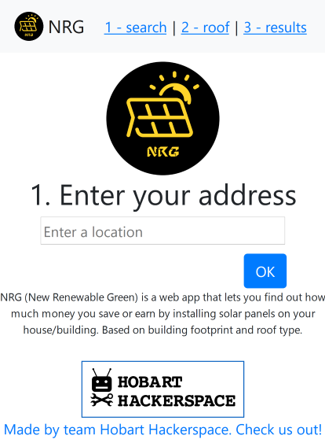
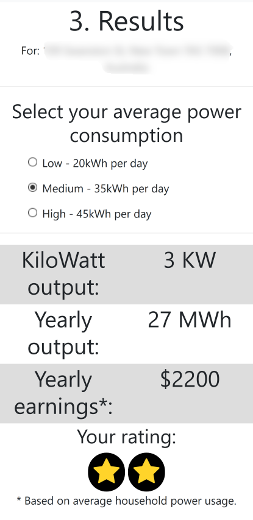

# Team Hobart Hackerspace's GovHack Entry
## New Renewable Green (NRG)



## Preface

During GovHack 2019, on 6-8 September, several members of Hobart Hackerspace (myself included) joined forces to compete and produce something.

We decided that we wanted to go after prizes. So we tried to think of an idea that would appeal to the local prize categories. These included:
* Most Outstanding Tasmanian Benefit
* Optimise energy and water resource planning
* Best Use of Tasmanian Spatial Data
* Climate Change Issues in Hobart

In particular, focusing on climate issues and enegry, this lead us to thinking of making an app based around solar panels.

## The Idea

Our idea was to create an app that calculated savings or earnings generated from installing solar panels on your property. Based on building footprint data - using footprints to calculate the area available for solar panels. It's a bit crude, but it's a start to something that will work. We also used heritage data to determine if a property is heritage listed. As such, there may be limitations on the property for installing solar panels.

## The Data

The most important dataset we used was building footprints for the Hobart region. This allowed us to calculate maximum area for installing solar panels.  See dataset: [http://data-1-hobartcc.opendata.arcgis.com/datasets/building-footprints](http://data-1-hobartcc.opendata.arcgis.com/datasets/building-footprints)

We also used "Heritage Places and Precincts" data to filter out buildings that are heritage listed. See dataset: [https://www.hobartcity.com.au/Development/Planning/Planning-guidelines-and-help/Heritage-Places-and-Precincts](https://www.hobartcity.com.au/Development/Planning/Planning-guidelines-and-help/Heritage-Places-and-Precincts)

Our data expert, Shane, mashed this data together to generate a single table of entries that included building footprint area and whether a building was heritage listed, or in a heritage listed area. We used a PostGIS database, as it was well suited for geographical datasets such as the ones we were using.

## Geocoding

We had an issue - we needed to translate a property position into GPS latitude and longitude coordinates. Our search box on the web page would generate a GPS position, however addresses in the provided dataset did not include a lat/long coord. So we needed to geocode (translate) the addresses into coordinates. We used a Python script to do this. And it outputted a CSV file with addresses and coordinates.

## The App

I was the main web app developer. I used Flask as a backend web server, due to it's ease of handling custom URL paths. I wrote the main web application in pure Javascript, and using jQuery and Bootstrap, which I had been using for a professional project. Despite being rather old and outdated, I like these technologies due to their ease of use and flexibility. 

### Generating Results

The web app is broken into three sections. 1 - enter your address, 2 - select roof type, and 3 - show results.

The first part uses Google Maps API for auto-completing your address. It is a rather simple Javascript utility provided by Google. You just need to sign up for a developer key on the Google Maps API web page. And then embed some code into your web page, including API key. As soon as an address is selected, the app starts looking up your building's footprint area. The main query command happened on the Python Flask backend side, querying the PostGIS database. The PostGIS command looks like this:

```mysql
SELECT ST_Area(geom) as AREA, heritage_zone, heritage_listed, shadow from buildings \
        where st_contains((select geom from parcels where \
        st_contains(st_transform(geom,4326),ST_SetSRID(ST_MakePoint({0[1]},{0[0]}),4326)) \
        order by st_area(geom) desc limit 1), st_centroid(geom))
```

This selects the area (meters squared), whether the building is in a heritage zone, whether the building is heritage listed, and a future variable - shadow (used for incorporating shadow from mountains, etc) - not implemented. From the selected coordinate, which is found by checking whether the coordinate is in any of the building areas.

The second page lets you select your roof type. We just used primitive roof types, most commonly used ones. Obviously there may be fancier roof types out there, but we couldn't accommodate for everyone in the time given!

The last page presents the interesting results. We use building area to calculate how many solar panels you can fit on your building. And using the average solar panel power generation amount, we can calculate how much energy solar panels would produce over a year. Also including how much energy is used by the average household - subtracting from the energy produced provides a savings or earnings amount.

Our (my) calculations for showing savings or earnings are rather crude, see the GitHub source [https://github.com/l33tllama/GovHack2019Solar/blob/master/static/js/main.js](https://github.com/l33tllama/GovHack2019Solar/blob/master/static/js/main.js). Add to that, not including shadows and fancy roof types makes it somewhat inaccurate for some buildings. However we just didn't have time to be perfect!

## Final Results



As you can see, this property earns $2200 per year! By installing solar panels.

Oh and we won several awards! Including a bit of prize money. We're hoping we may get paid to flesh out the idea as an actual app.

**Live site:** [http://nrg.hobarthackerspace.org.au/](http://nrg.hobarthackerspace.org.au/)