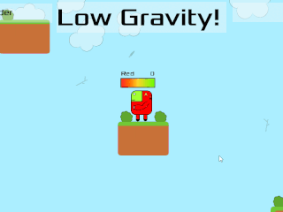

## Game Release - Gravity Flux

Lately I’ve been very busy in my own personal time working on a new game that I’ve released on Steam!

[Gravity Flux](https://store.steampowered.com/app/2072520/Gravity_Flux/) a local multiplayer 2d fighting game where gravity changes. Available now at a very affordable price.

You can see development updates on my new game development website, [MotleyPixels.com](https://motleypixels.com/). 

The game released on September 30, and I hosted a launch party at the local Kickstart Arts “Old School” room. A lovely spacious room with a projector screen and separate TV for another game, [ShapeVS](https://store.steampowered.com/app/1575750/ShapeVS/) (another Tasmanian game launching on the same day!).

Making and releasing a game was something I hoped to set out to do back in 2018, with [Wizards with Rockets](http://leofebey.com/projects/game_wizardswithrockets) but that was taking far too long, being a game hand-written in C and Allegro. Very tedious.

So back in October 2021, I decided to pick one of my game jam games that I thought was fun, and turn it into a full game to release on Steam. Eleven months later, it was released! It took a bit longer than expected, but By June 2022 I was ready to sign up for Steamworks and start the game release process.

There have been **many** lessons learned along the way, about Godot, Steam and the logistics of releasing a game, including marketing, and dealing with scammers.. Which is great, I was hoping to become a valuable resource to my friends and the [Tas Game Makers](https://tasgamemakers.com/) community, for people to ask questions about how to make and release a game on Steam at least.

As far as side projects go, it was pretty epic and I’m happy to have done it. I would recommend releasing a game if it’s something you think you may be able to do (have the time, motivation, etc). You don’t have to make the fanciest, flashiest game, just something that’s fun and you can show off at a launch party.

The post-release period has been a bit wild, the natural “low” after a “high”, plus some other distractions that threw me around a fair bit, but I am keen to keep updating the game with small fixes and features.

Kicking goals like this is something I have been trying to do more of these days, with my personal projects such as 

- Telepresence robot
- Internet Radio Alarm Clock
- YouTube channel (and mini projects)
- Gravity Flux

And more in the works. It is a **lot** of effort to make practical projects and complete them. Looking back at these, it’s not a lot but each one has been a big effort. For those that complete projects, I salute you!

  

I’ve had a lot of projects build up during this game project, and now I have lots of things to work on, such as a virtual pet project, more games, youtube videos, new business website, my music library program, and more. My current focus is getting focused on what to work on next. The first thing is some updates for Gravity Flux, but after that, probably an important one is my new business website, leofebeytech.com.au, which may be written from scratch, using denojs and lume. Not sure yet. But I sure have stuff to do.