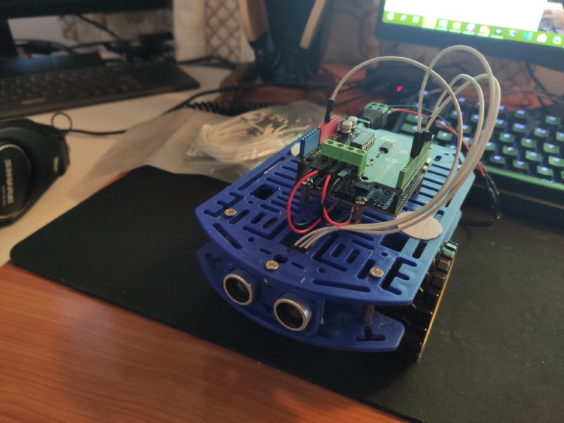

# My First Workshop that I Hosted - CircuitPython Robot

I have been meaning to run a workshop for a few years now. I have many compelling skills, and I was thinking that it would be good to share them with people.

I've had some ideas for workshops. My first idea was to run a workshop where you solder a circuit board for a robot, and using my own designed laser-cut chassis. Unfortunately that idea occurred to me during a very busy time. So it didn't quite get to the stage of running it.

As one of my self-employment services, I have decided to actually run workshops! For my first workshop, I was thinking of the popular theme, robotics. 

## First Workshop - CircuitPython Robot

My decision to use CircuitPython as the development board was chosen due to it's extremely easy learning curve, and speed to get started. With Arduino, you need to know a little more technical things, such as variable types, arrays, objects, pointers, etc. With Python, it is quite simple and easy to get into from a beginners perspective. You also generally write much less lines of code to achieve the same thing versus other languages such as C, C++, Java, etc. Another reason is that the time from typing code to running it on the board is extremely quick. This allows for making a lot of mistakes without waiting too long to see what went wrong.

The robot idea was quite simple, just a robot that avoids obstacles using an ultrasonic sensor. The key parts were:

* Robot chassis pack (From Little Bird Electronics - chassis, motors, wheels, battery pack)
* Metro M0 Express development board (CircuitPython, Arduino form factor)
* DFRobot 1A motor shield (Arduino form factor)
* HC-SR04 ultrasonic sensor

And that is about it. Quite simple to get started easily. Anyone over the age of 8 or so could probably assemble it without too much extra assistance.

## Assembling it at home - making it work
I put together parts of the robot. The most important parts to get working were the motor controller and ultrasonic sensor. The motor controller draws a lot of current when the motors are running, causing the microcontroller to lose voltage level. This can cause a microcontroller to reset. I eventually came to the solution - which was to connect the VIn line to the 5V line. This made the voltage to the microcontroller stable enough to not reset. There is a regulator on the VIn line, producing 5 volts. This 5 volts can be much lower when the VIn line drops. Whereas connecting the VIn (which is around 5V normally) directly to the 5V line doesn't drop voltage as much as what comes out of the regulator.  

For the ultrasonic sensor, it required a 5V input. I was quite fortunate with this board. Despite being a 3.3V microcontroller, it seemed to work OK with the 5V HC-SR04 ultrasonic sensor module. Most other boards I have used with the ultrasonic sensor didn't work, like the last board I used, the SwiftIO MadMachine. That required a logic level converter for it to work. No logic level converter needed for this. I am not sure why, perhaps it is outputting slightly more than 3.3V? I didn't check.  

Luckily I put it together in time and got it working well before the workshop date.

*Image above - Robot assembled at home (working)* 

## Coronavrus Delay

Of course, my workshop was planned to run during a pandemic outbreak. Here in Hobart, there were a few cases that occurred. Our government ordered us all to stay home and limit physical distance. So we were legally not allowed to run a workshop with several people in a small room / close proximity, from late March to early May 2020. Once cases reduced to 0 for a while, restrictions eased and we were allowed to go out again. I checked up on those who had registered and organised a date. I also got two more new participants.

## The Day - 5 July 2020 - 1 to 5PM

I got there early, at about 10:30AM, in order to set up and prepare. A few also turned up early. There wasn't much to set up, though I had to update the Metro M0 Express boards with the latest firmware to be compatible with the latest libraries.

I had not run a workshop before, so I wasn't sure how to orchestrate a "workshop experience" which involves things like participants introducing themselves and a bit of verbal dialog about the workshop. I did some of that, but perhaps could have done more. There was 5 people that attended the first workshop.

The workshop started with everyone assembling the robot chassis. This took quite a while and everyone encountered some difficulty. The chassis is good quality, but was not designed well enough to be easy to assemble. There were some parts that required some fine motor skills to assemble. Everyone assembled it however.

My instruction book showed the participants how to install the microcontroller, ultrasonic sensor and motor shield. This part was quite quick and easy.

The next part was programming. This could have been split into several workshops to cover thoroughly. In the end, most of the participants just copied and pasted code. But they were still guided into programming with Python in the instruction book, and I was around to assist.

By around 4PM, almost everyone had completely assembled their robot! We had one major issue - some of the batteries were not charged! (Enerloop pack from eBay..). But some of them were and they worked. There was also my reference robot to see what it should be like.

At the end, several people told me that they quite enjoyed the workshop! So I can say that it was a success.

## Going Forward

I definitely intend to run more workshops in the future. But not just robots, other things as well. My next workshop will likely be about using a Raspberry Pi to collect sensor data and put it on the Internet. Stay tuned to my mailing list and Discord channel to hear more!

## Workshop Pictures

You can see pictures of the workshop on my workshops page - [http://leofebey.com/services/workshops/robot-workshop-circuitpython-beta](http://leofebey.com/services/workshops/robot-workshop-circuitpython-beta)

