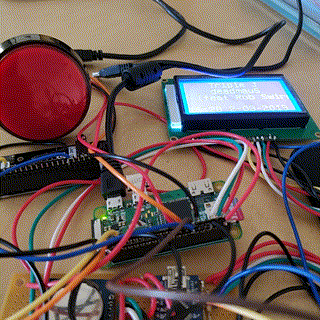
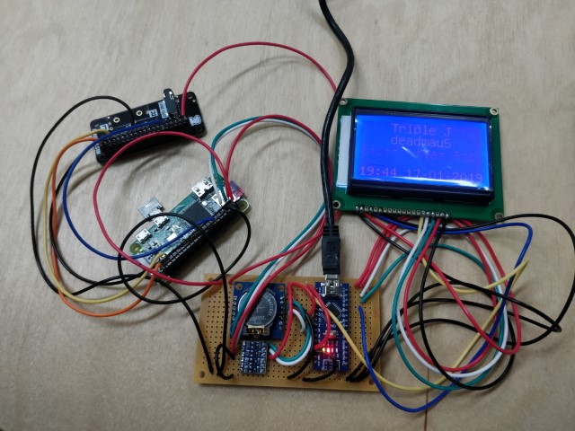

# Net Radio Alarm Clock Soldering Update

I have moved the components from breadboard to circuit board, ready for assembly in a case. I was having intermittent connection issues affecting the LCD mainly as well.

Here are some pictures of the project assembled on a circuit board and working.

