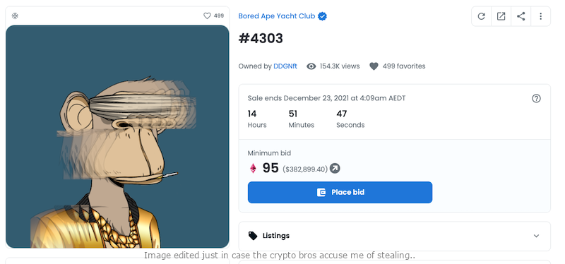

# The Obvious Problems with Cryptocurrency and NFTs
## About Cryptocurrencies

In case you've been living under a rock, there has been a rather large trend of the use of cryptocurrencies in the last 2-3 years. Bitcoin, Ethereum, etc. These are exchangeable currencies that you can buy and sell. As well as mint coins if you want to, which involves a serious investment..

I won't go into the detail about how they work, but they all use a "blockchain" which is a distributed **read only** ledger which contains transactions.  It's a good fit for a currency, however some people are trying to bludgeon the tech into other kinds of projects (Like Kickstarter..).

## Minting or "Mining"

Here is where there is a lot of controversy. Bitcoin in particular, requires you to use heavy computing resources to "mine" coins. If you want to make your own Bitcoin, you can, but you need special hardware, either a graphics card or an ASIC (Application Specific Integrated Circuit), a specially designed chip for solving a certain task. Both of which consume a lot of energy. The task, is to solve a hash number, which is what input number gets turned into a smaller "hash" number that is unique to each input. If you change one small number in the input, the hash changes drastically. So the goal of Bitcoin mining is to find what the input number is. But it does all of this for no useful reason. It is purely to show others that you've done *some* work, which is quite substantial, proving you are willing to invest in hardware and electricity to get these coins.

## Power Consumption

As you can see, lots of people trying to mint coins and run the network can cause a **lot** of power consumption. As of May 2021 (*1*), Bitcoin uses around 110 Terawatt hours per year, which is 0.55% of the world's electricity use, or roughly the same amount as the country of Sweden or Malaysia. So that's a lot. This is not a great way to help solve the ongoing climate emergency we are currently living in.

## Proof of Stake

Now, the people who write cryptocurrencies are realising this little embarrassing fact (of heavy power consumption) and are trying to find an alternative to the "Proof of Work" method for transactions. So they have come up with alternatives - mainly "Proof of Stake", but there is also "Proof of Authority". Focusing on PoS. This means the person or computer generating transactions must "stake" some of their own coins before they are allowed to complete the task, so if they do something fraudulent, and others notice, their "stake" (on Etheruem it's 32ETH - currently $180,000 AUD). This is certainly a nice improvement over PoW, and much appreciated by anyone who cares about the environment and future generations. However there are still other issues with crypto currency.. And mining coins still involves solving hashes -  which is less common, but still attracts a certain type of person who wants to "generate free money".

## Scams and Fraud

There has been a massive influx of scams going around. You might have seen things like "Elon Musk Bitcoin Giveaway" perhaps. These are all fraudulent and are out to steal your money. They ask for you to send X amount of Bitcoin (usually over $1000 worth) and they say they'll send you more back. But they won't. No matter how well-presented the website looks (scammers are getting very crafty these days) it's a scam. The big reason why these scams are more common is that **you can't reverse blockchain transactions**. So if someone fraudulently scams you of your money, you can't contact anyone to reverse the transaction to get your money back, **unlike** how all major banks, and PayPal can do. This is a very dangerous issue with cryptocurrency and it ought to be resolved somehow. I'm not sure how exactly, but it's definitely one big issue to get over before any cryptocurrency can be taken seriously by users (and sellers) as an alternative payment method.

## Investment Fluctuations and Teaming Up

Another quirk of cyptocurrencies that you may have seen. You can certainly buy cryptocurrency, and due to it's extremely volatile nature, there is a chance you might make some money out of it (after you sell your cryptocurrency again). Which attracts a certain type of person (gambler). There is often very little insight as to which cryptocurrency will rise, just a lot of "word of mouth" speculation. "I hear Shiba Inu is going to gain!" so the punter throws a few grand at it and hopes and prays.. But as it's not backed by any physical goods (like gold or a country's GDP) it is extremely unpredictable. So some people like to team up and "game" the system. They'll probably coordinate on private Discord servers, Reddit, etc, and conspire together to all invest at once, then wait for others unaware of their plans to follow the trend, then all pull out all at once, profiting off of others who are not in the loop. I believe this is essentially insider trading, which is highly illegal, however there is no way to detect it and arrest people for it, due to the untraceable nature of cryptocurrencies.  This is another issue that needs to be solved.

## NFTs

Just when you thought cryptocurrencies couldn't get any worse, someone invented NFTs. What is an NFT? It's a "Non-Fungible Token" which means a special digital token that represents something (like a piece of art) that can't be reproduced for the same value, unlike a coin or a movie ticket. It is more akin to a digital one-of-a-kind trading card. It is based on blockchain technology. I think the reason for inventing it was a bit blurry. Do we need this tech for any good purpose? Art and creative media can already be sold online, and an artist can copywrite their work so it belongs to them. Why transfer ownership? I won't try to answer this question for now. I haven't seen many good examples (except for maybe Beeple..). NFTs also suffer from the investment fluctuations issue. Except this time, it's people conspiring to increase the price of a certain set of NFTs, such as Bored Apes or Lazy Lions. These now cost stupid amounts of money (I saw one bidding for $380,000), and all for just a weird looking cartoon animal? It clearly shows a vast difference between perceived value of the art, and the actual "token" representing the art. Also, once the original artist has minted their NFT, sold it, obviously they can't make any more money out of that art. They can't make posters, stickers, etc, because the art does not belong to them any more. The ownership fluctuates, which makes selling copies of the art extremely awkward and difficult. So it's not great for all (many) kinds of art.
## Artists vs NFTs

I use Twitter a lot, and I have seen *many* people, notably artists express a negative opinion about NFTs and crypto. For reasons such as, the art is being used by "crypto bros" to make money out of speculative investment, the power consumption associated with blockchain tech, and the huge amount of scams out there. There's a strong disliking among many people I follow, for NFTs in particular. 

I was a part of a Twitter thread where I started the thread saying to a particular developer that I was dissapointed in them using NFTs in their product. Another user (who I will not name here) said: 

> Imagine the excitement and <joy?> you could have gotten by instead commissioning 30 small time artists to create real, beautiful works of art, and allowing VIP users to collect them on the platform by achieving certain milestones (finishing shows etc). Instead, you did this? (create NFTs)

I think the message here is that artists could be being put to work (and paid) much better for much better art that people get to enjoy, instead of little cartoon gorillas (that wouldn't have taken much effort to make) being traded around to make a small number of people (not artists) rich. 

   
*Can someone please explain to me why this ape is worth $382,899.40? Meanwhile numerous artists go underpaid or unemployed?* 

## The issues that need to be solved

With cryptocurrencies

* Reversible transactions to deter scammers
* Somehow deter "insider trading" or conspiring to buy and sell
* *ALL* crypto-currencies should not use Proof of Work
* Make it easier to **buy things** with, like as easy as PayPal, Amazon, etc. Without any major transaction fees.

With NFTs

* Same as above
* Find and promote more "useful" purposes for them, if any
* A closer ratio of "perceived art value" to "token value"

## Closing Notes

So yeah I've highlighted a lot of bad things here, but there are some good ideas in crypto/blockchain, hidden under the bad. A decentralised currency sounds like a good idea, to be free of banks which we are dependent on, and come with their own set of problems (like their absurd wealth, profiting from their users). In the early days of Bitcoin, I envisioned it as it could be a kind of potential PayPal killer. But with the issues above, I can't see how cryptocurrencies will replace banks or PayPal any time soon. Also, Merry Christmas! And thanks for reading.

#### References 

*(1)* https://hbr.org/2021/05/how-much-energy-does-bitcoin-actually-consume

