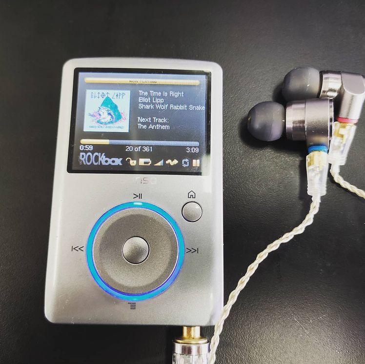

In 2004, when I was about 14, my parents bought me an iPod (classic) 4G. A portable music player with a whopping 20GB of storage. That was heaps of space back then.
I got great use out of it. I was young, had little money, so I "acquired" music through various sources (Limewire, LAN parties, etc). It was a great way to manage my music collection, and bring it with me wherever I went.
Later, I was given an iPod Touch 1st Gen. It was ok, but it only had 8GB of storage. Not quite as good for carrying my whole music collection with me.
I later then discovered the Sansa Fuze (media player) and Rockbox (custom firmware). I bought a Sansa Fuze (must have been 2009-2011, can't remember..). It was my favourite media player. Better than my iPod. I could fit more music on it, and use a better media library program on my PC, MusicBee. 

From the start with the iPod, I made great use of **"Smart Playlists"** a feature which lets you generate playlists based on a list of rules. For example, all songs that have a rating of 4 or above. Or all songs added in the last few months. I found it extremely useful for listening to just the relevant music that I wanted to listen to.

Now, with streaming services, you only get static playlists. You have to **manually** add and remove tracks. Very tedious and annoying if you want a playist that changes a lot. For example, the best I've been able to do is make a yearly playlist. Like 2021 Starred Tracks. This is nice, and does give me some good music. But it's particularly annoying for the first few months of the year. It's a rather small playlist. I have to switch between the current year playlist, and the last year playlist, which is kinda annoying because I just want to listen to the newest tracks (last 12 months max) - on a single playlist for simplicity.

Streaming obviously has it's benefits. You get access to a pretty massive selection of music. And public playlists. But I still really miss smart playlists, and owning my own music library as individual media files that can be put on any device and played with any player.

So recently, I bought a second-hand Sansa Fuze (I lost my old one..) and installed RockBox firmware on it (custom firmware with many more features than the stock firmware/OS). And it has been pretty great, for the most part..
I've decided that I don't want to pirate my music any more. I want to actually pay artists for their music, in 2021, when they usually get a tiny amount on streaming platforms - see https://soundcharts.com/blog/music-streaming-rates-payouts (.3 cents per stream on Spotify). Not really fair for some indie/less mainstream artists.
So, my personal music collection does consist of some albums and tracks that I've bough in the past, but not a majority of the music I've ever listened to. It's a funny mix of albums like Monstercat, Mux Mool, several Bandcamp albums, and a few other albums I've bought out of appreciation.
But, I am strangely liking this new (old) experience. I feel a bit more connected to the music and the artists. I guess I enjoy the music more.

It's been about a week now since I started using MusicBee and my Sansa Fuze. I've been finding myself using it more than my phone. It's probably partly because to justify all the effort put into setting it up, and nostalgia. But it's also somewhat refreshing, coming from streaming services. It's a new set of music to listen to, music that I either bought, or was freely available (public domain). Music or artists that I care somewhat about.

##### How can you have a similar setup?
If you're on a Mac, it seems that iTunes has died and been replaced with a suspiciously similar app called "Music". I tried using it on a Mac, and it won't let me add my own music files! How dissapointing! So I guess you'll have to run MusicBee through Crossover, like what I did. Same deal with Linux (or prey to the wine gods that it'll work with wine).

For media player, it's a bit difficult. Any device with Rockbox, I'd highly recommend, if you can find one! Older iPods seem to be supported, which is nice.
I'm looking at buying a Fiio M3k media player (a bit old now..). If it doesn't play nice with my .m3u playlists generated by MusicBee, apparently there is a somewhat stable port of Rockbox available for it, which is great.

I also intend to keep using streaming services (TIDAL in my case). Because it is a really handy tool for just listening to that one track (or album or playlist) you want to listen to. I can't deny how useful it is. But overall, I'm still finding myself drawn to this standalone device. It's very neat. But maybe one day, my music collection will be so big that I won't need streaming services any more. That'd be ideal.

