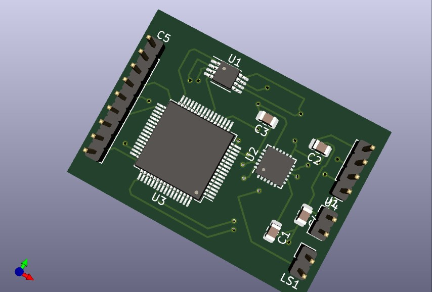
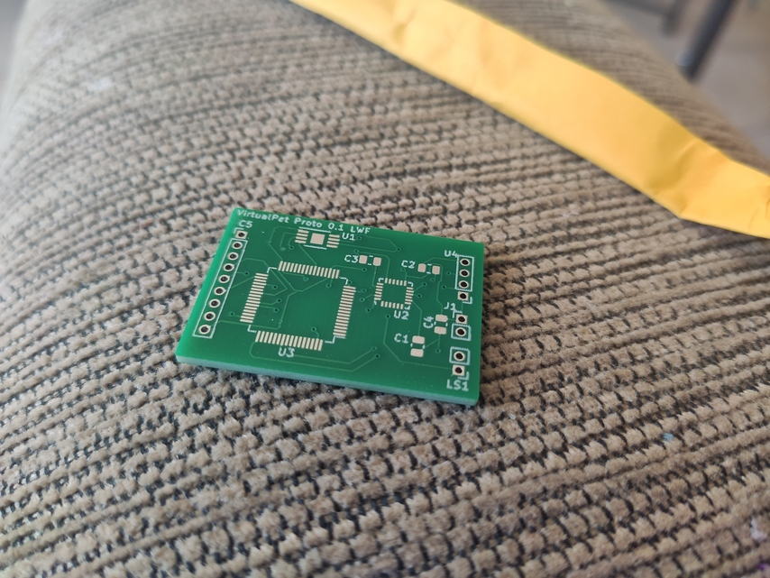
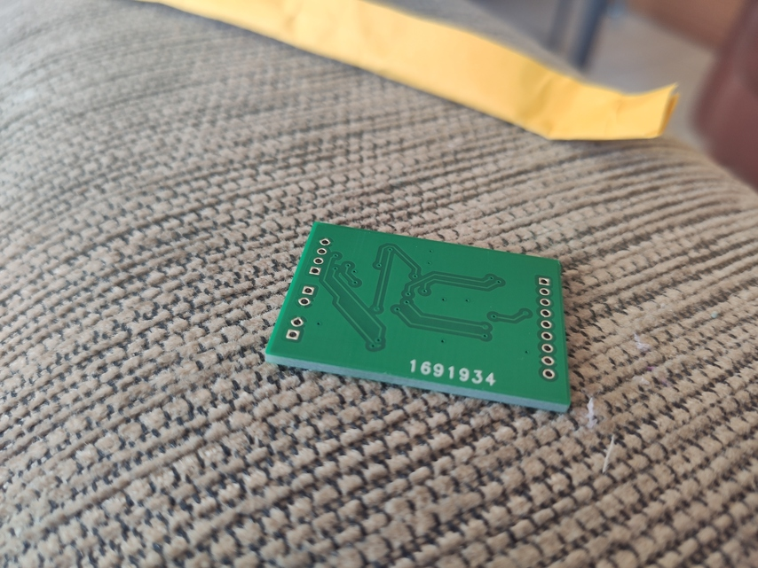
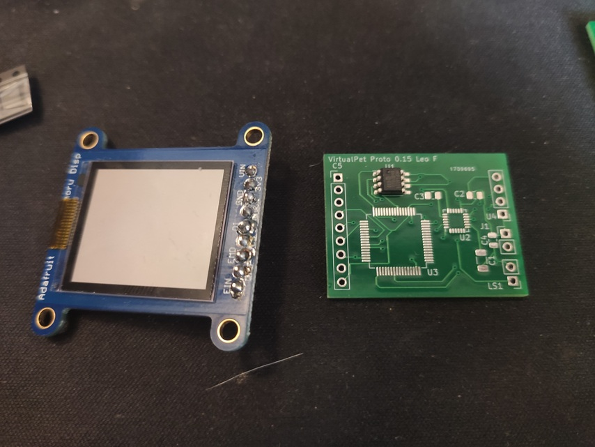
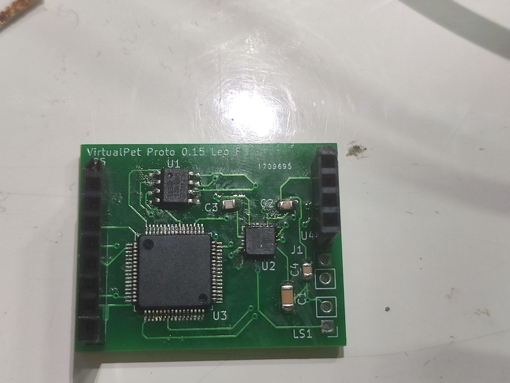
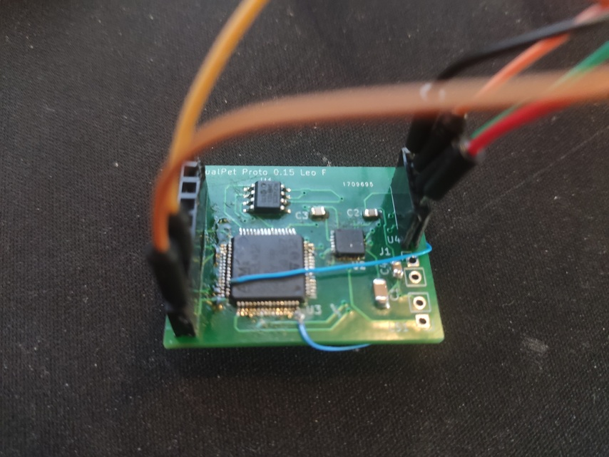
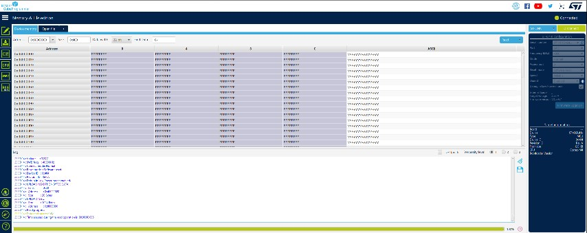

# SeeedFusion PCB Review (Part 1)

## Background

As some may know, I have started a new project, which is an electronic virtual pet, kinda like a Tamagochi but aimed at improving your health and well-being. A little friend that can encourage you to live healthier. The project is using an STM32 chip because they are much better value than AVR chips, and this particular one I found very similar to an AVR but has more memory (128K Flash and 40KB RAM vs an AVR which has 32KB flash and 2KB RAM - much better!). I picked those parts way back in 2019 I think, before the global chip shortage. So now all chips are quite expensive. Oh well, the 128KB flash will be useful for storing small images and sounds.

## PCB

I designed the PCB with my PCB design tool of choice, KiCAD. I have used it a fair amount before, for a project I worked on with CSIRO in Hobart. I designed a board which was going to be an open hardware satellite GPS tracker. The board seemed to work but unfortunately time ran out and I didn't get to complete it. I might take the project back on one day with a new perspective.  
I had to re-learn KiCAD a little, but some of it came back to me quickly, and it's actually not all that difficult to use. The most difficult part is the lack of certain components for schematics and their footprints. I had to design just the schematic parts for this, but I may run into designing footprints in the future, we'll see.
Here is a screenshot of an earlier version of the PCB:

## SeeedFusion PCB
I have bought a few products from Seeed before, they're a pretty good store, they make some good bits and boards at good prices as well. SeeedFusion PCB was also pretty well-priced. The upload process was fairly simple, just upload you board files, pick a board size, quantity, colour. Nothing too complex. You of course have the option of multi-layer.
The price for the 10 boards I got made in a batch was \$4.90 USD (I could get 5 boards at the same price, so I got 10). That is a fairly standard price I have heard. Though the price of shipping was much higher, at \$19.11 USD. That is also a pretty standard price for shipping, unfortunately. If you can find a PCB assembly service that is overall cheaper, good find!  
I made one board, it arrived, and it had some problems such as incorrect footprints (which was my fault). So I had to redesign the board and that gave me the experience of using SeeedFusion PCB twice. I found that the assembly time was about 1 week or so after submitting the board. Then shipping was up to two weeks (slower over Christmas holidays). So about 2-3 weeks total for it to arrive to Hobart Australia. Not super fast but if you don't need speed (which I don't really - I'm taking my time) it's alright.  
Just an extra note - they sent a photo of the board package as it was shipped. It wasn't a very useful photo but did confirm it had been made and had been shipped. I guess they could send a better photo of the board? But that is just nit-picking. Not an essential feature.  
  

## The board
The first board that I received had some incorrect footprints (my fault) but looks good:  
  
  
The second board had the correct footprints, but I had some slight errors (again, my fault), as you do when prototyping..  
  
  
  
I am quite happy with the quality of both boards. They do not look that "cheap" and could be happily used in commercial projects. They are fairly thick at 2mm. I waited until I could test the board with a working STM32 programmer before writing this review. The chip and the board works! As you can see in the STM32Cube Programmer screenshot.  

## Summary

I would happily recommend SeedFusion PCB to anyone wanting to get a PCB made for protoyping or making a commercial product. The build quality is good, prices fair, service is very good. A local fellow hobbyist mentioned to me about JLPCB (similar service) which had very similar prices. I can't speak for his experience that accurately, but he said they were good as well. I guess if you can find better shipping prices, it may be a good option, but do your research on quality before committing to a commercial product.
