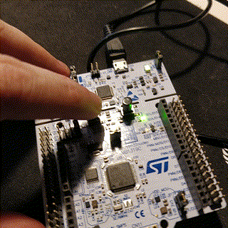
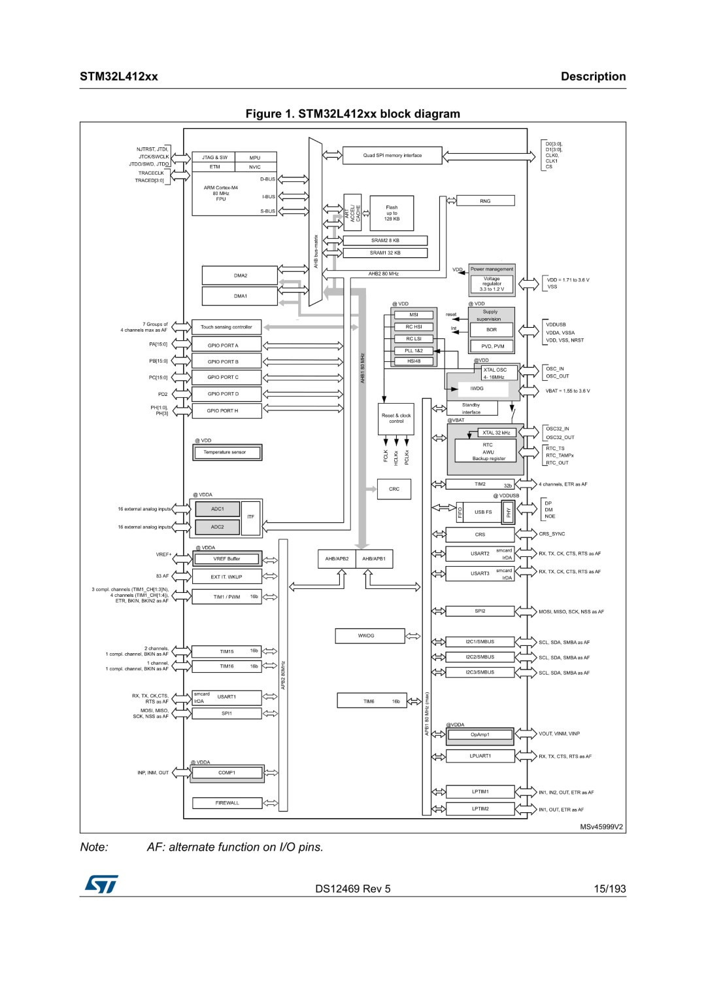
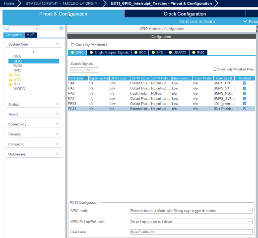
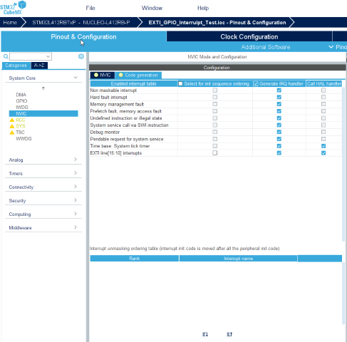
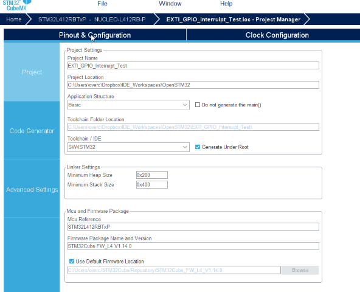
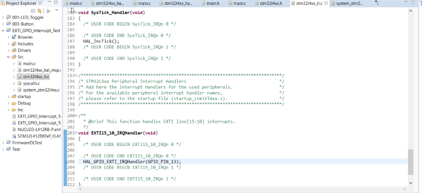

# Adventures into STM32

I've decided to learn how to use STM32 microprocessors for future use in my embedded applications.  

## Why?

* Low cost - you can get boards for a few dollars each
* Great intelligent development tools that are cross platform (Windows/Mac/Linux)
* More powerful and less limited than AVR - you can start to write some serious applications for them (multiple libraries, more emebedded data, etc)

## Where to begin
I have bought a course on Udemy called ['Mastering Microcontroller with Embedded Driver Development'](https://www.udemy.com/course/mastering-microcontroller-with-peripheral-driver-development/) which looks to cover developing code for STM32 very thoroughly, including coverint acessing registers, clocks, peripherals, etc.

## Learnings so far

The STM32 chips consist of an ARM Cortex-M* core, with busses attached for peripherals/memory by ST.

The system design for the board I'm working on is below:  

## Interrupts

The first major challenge is to get interrupts working. Interrupts are events that are called when something happens - eg. a pin changes value from low/high or high/low.

Interrupts are handled by the EXTI controller. Each pin per port has it's own interrupt register. For example pin PA0 connects to EXTI0 and PC13 connects to EXTI13.

To enable interrupts on a particular port, in my case PC13 on the NUCLEO-L412-RB-P board, you need to set it up in STM32CubeMX software. This software is very useful for generating projects with peripherals set up with less coding required.

First select your board/microcontroller. 

In System Core,
Under GPIO, select your pin and choose External Interrupt Mode with Rising edge trigger detection.  

Select NVIC and enable the EXTI line interrupts.  

On the same page, under the code generation tab, make sure 'Generate IRQ handler' is ticked for 'EXTI line x' interrupts.  

Now generate the project, make sure it has a project name and location (Workspace location of your IDE). I'm using OpenSTM32 IDE, so for IDE/Toolchain select 'SW4STM32'.  It may ask you to download firmware. This is about a 750MB download.

Once generated, you can import it into your IDE's workspace.  

Open 'Src/stm32l4xx_it.c' and scroll down to EXT15_10_IRQHandler. This is the interrupt routine. You can attach a breakpoint to that line and watch it stop when you press the button on the development board.

