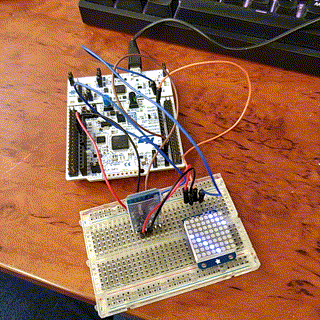
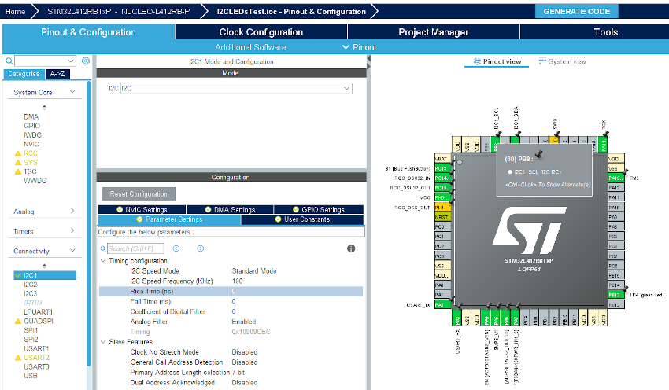

# I2C Demo for STM32 (LED matrix array)



I2C or Inter-integrated circuit is a communications protocol for microcontrollers to speak to other microcontrollers or intelligent chips that can respond to and act on commands.

Devices on the I2C bus have an address, predetermined by the manufacturer, but can often be changed in some way, eg. over I2C.

I won't go into deep explanation on how I2C works, but to simplify, it sends a start command, recieves an acknowledgement and sends data and then sends a stop command.

STM32 microcontrollers usually offer I2C capabilities. I wanted to learn the low level register commands to enable I2C, but I'll have to do that another day. This guide is just how to get I2C working with minimal effort for STM32 devices.

Firstly, you'll have to create a project with STM32CubeMX software. It is an excellent tool.



In the Pinout & Configuration, select the appropriate pins for I2C. On my board, it was PB7 and PB8 which break out to the I2C pins on the Arduino headers. Click on the pins themselves and enable I2C SDA and SCL pins from the available options.

Then, under Connectivity, select the appropriate I2C bus (For me, I2C1) and select I2C. 

If you want, you can enable USART, but I'll cover that in another post.

Now, name your project in Project Manager and click Generate Project.

Once it's exported, open it up.

There is not a lot to I2C programming with STM32, there are two useful commands, 

```C
HAL_I2C_Master_Transmit(I2C_HandleTypeDef *hi2c, uint16_t DevAddress, uint8_t *pData, uint16_t Size, uint32_t Timeout)
```
and
```C
HAL_I2C_Master_Recieve(I2C_HandleTypeDef *hi2c, uint16_t DevAddress, uint8_t *pData, uint16_t Size, uint32_t Timeout)
```
## Testing out the 8x8 LED Matrix

For testing out the LED Matrix, it is not as simple as sending a command for what LEDs you want to show. First, you need to set up the matrix array.
You need to start it's internal oscillator, set the blink rate and set the brightness.

### First set up command definitions
```C
/* USER CODE BEGIN PD */

#define HT16K33_BLINK_CMD 0x80
#define HT16K33_BLINK_DISPLAYON 0x01
#define HT16K33_BLINK_OFF 0
#define HT16K33_BLINK_2HZ  1
#define HT16K33_BLINK_1HZ  2
#define HT16K33_BLINK_HALFHZ  3
#define HT16K33_CMD_BRIGHTNESS 0xE0

/* USER CODE END PD */
```

### Declare global variables
Declare transmit and recieve (not used here) buffers and the LED matrix address. In STM32, the address needs to be left shifted by one for some reason.

```C
/* USER CODE BEGIN 0 */

uint8_t iTxBuffer,iRxBuffer;
const uint16_t LED_ADDR = 0x70 << 1;

/* USER CODE END 0 */
```

### Set up the matrix array with I2C commands
Now we can set up the matrix array before use to display the LEDs.

```C
 iTxBuffer = 0x21;
  HAL_I2C_Master_Transmit(&hi2c1, LED_ADDR,&iTxBuffer, 1, HAL_MAX_DELAY);

  // Set blink rate
  iTxBuffer = (HT16K33_BLINK_CMD | HT16K33_BLINK_DISPLAYON | (HT16K33_BLINK_OFF << 1));
  HAL_I2C_Master_Transmit(&hi2c1, LED_ADDR,&iTxBuffer, 1, HAL_MAX_DELAY);

  // Set brightness
  iTxBuffer = (HT16K33_CMD_BRIGHTNESS | 15);
  HAL_I2C_Master_Transmit(&hi2c1, LED_ADDR,&iTxBuffer, 1, HAL_MAX_DELAY);
```

### Showing LEDs

The following code will display diagonal lines on the LED matrix array.

```C
  /* USER CODE BEGIN WHILE */
  uint8_t counter = 0;
  uint16_t displaybuffer[8];
  uint8_t to_leds_buffer[17];

  while (1)
  {
    /* USER CODE END WHILE */

    /* USER CODE BEGIN 3 */
	  for (uint8_t i=0; i<8; i++) {
		// draw a diagonal row of pixels
		displaybuffer[i] = 1 << ((counter+i) % 16) | 1 << ((counter+i+8) % 16);
		
	  }

	  to_leds_buffer[0] = 0x00;
	  uint8_t j = 0;
	  for(int i=1; i < 17; i+=2){
		  to_leds_buffer[i] = displaybuffer[j] & 0xFF;
		  to_leds_buffer[i+1] = displaybuffer[j] >> 8;
		  j++;
	  }

	HAL_I2C_Master_Transmit(&hi2c1, LED_ADDR, to_leds_buffer, 17, HAL_MAX_DELAY);
	counter++;
	if (counter >= 16) counter = 0;
	HAL_Delay(50);
  }
```

### What to do next

My next post will likely be about USART communication (with GPS/Bluetooth). But there is much room for improvement with the LED matrix. I could continue to port the Adafruit library and do things like alphanumeric characters. 