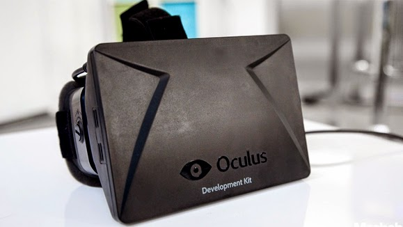
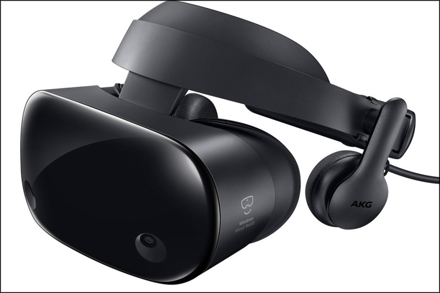

# VR Headsets Should Be Cheaper

With the release of Half-Life: Alyx, it has set the stage for VR becoming a serious platform for gaming. Finally, VR has a killer app that can bring new people to the platform.

But, from my own Steam friends list, no one (so far) has bought it. However, back in 2004, basically all of my friends bought Half-Life: 2 shortly after it was released.

Why is that? There are a few reasons I can think that people haven't bought it  
* Less interested in games than when they were 14-15 or so in age (growing out of games a bit)
* Not interested in a prequel to Half-Life: 2, more interested in a continuation of Half-Life 2: Episode 2
* Less time to play games (now that most of my friends are around 30 years old and have full-time jobs)
* The game is expensive (at $85 AUD) - now people are used to buying games that are cheap or are on sale (thanks to Steam sales)
* VR headsets are expensive! $1299 AUD for the HTC Vive - that's more than most sensible monitors.

The first 4 reasons will exclude a few people, but not all. However the last reason - VR headsets being expensive, is a serious factor to basically all of my Steam friends.

At $1299 AUD it is a very serious investment. My 27" 144Hz 1080p monitor cost only $329 AUD. Most people don't spend more than $500 AUD or so on a monitor alone. But VR manufacturers are expecting people to pay over $1000 AUD for a headset (and controllers) which are only used for up to a few hours per week. I must admit, it is a pretty unique and cutting-edge piece of technology that is more or less worth it. But, I don't see why there aren't more VR headsets that cost much, much less. It is definitely possible to make a VR headset at a much cheaper price, and still deliver a good experience. Sure, not quite as good as a HTC Vive Cosmos or Valve Index. But good enough such that you won't be too disappointed.  

## Oculus Rift DK1 - What I want more of

The original Oculus Rift, on Kickstarter cost a mere $300 USD (about $550 AUD now, adjusting for inflation). It was praised to be a 'breakthrough' in VR headset development that raised the bar in VR experience versus other headsets that had been developed in the previous decade. 

The specs for the Original Oculus Rift:
* 1280x800 resolution (split into two)
* 6DoF head tracker at 125Hz+
* No controllers
* No spatial awareness

By today's standards, it is pretty crappy. It is far behind current VR headsets. But back then, it was a foot in the door to new VR experiences.

## HTC Vive - Understandably Necessary Innovation
The HTC Vive, released in 2016 was a significant improvement over the previous VR headsets available. However, it was one of the first VR headsets to dramatically increase the price. It cost $799 USD on launch.

HTC Vive Specs:
* 2160x1080 Pentile OLED
* Vive base stations that accurately track the headset
* Vive controllers

This headset, while expensive, pushed VR forward in a significant way. It gave the user a much clearer image, and much more responsive and accurate headset tracking. I can understand the reasoning behind the specs choice behind it - it showed us how good VR could be.

But now, almost 4 years later, as technology naturally progresses, we still haven't had a cheaper, popular and readily available alternative to the original Vive available yet. Well, there kind of has been, but they have been so hard to find that they are basically unkown to even the more enthusiastic PC gamer.

## Found one! Maybe..
  
After some research, I have discovered *one* (decent) cheaper alternative to the original Vive, the Samsung HMD Odyssey+. It is a Windows Mixed Reality headset, that includes controllers. It is *only* being sold in the US, but I beleive that international shipping is available.

The Samsung HMD Odyssey+ specs:
* 2880x1600 AMOLED display !!!
* Inside-out tracking (like the Oculus Rift S)
* Controllers that are eerily familiar to the HTC Vive controllers

This is an improvement over the original HTC Vive, and it costs less, at about $369 USD! Woohoo, innovation!

I guess I could say that I've found my substitute VR headset then. But not entirely.

Currently, I am struggling financially, and even a $600+ AUD purchase is very daunting. It would be nice if there was an *even cheaper* alternative available. At say $450 AUD or so. Then, I would feel like I might have a chance of playing Half-Life: Alyx (and other VR games/experiences) some time, maybe in the next 6-9 months.

Also, rather annoyingly, the Samsung headset is *only* being sold in the US! I'm not sure what shipping costs. It could be quite expensive on top. If it was available in Australia, I'd be more inclined to save up for one and buy it (even if it took a while).

## Summary
VR was originally pretty affordable with the Oculus DK1. I almost bought one (but being 22 and a student at Uni, I couldn't quite afford it). This brought **VR to the masses** which helped establish VR in the industry. However, VR headset makers have decided to utilise expensive, cutting-edge specs that raise the price quite significantly. This no-longer brings **VR to the masses**. I was hoping that VR would get cheaper since then, and it sort of has, but not well enough. There should be **more options** available at **lower prices**, and they should be **more available** like in places like Australia. But this is not the case. As such, I think it may be a *long time* before I buy a VR headset. It could be over a year. Which is a long time to wait considering my favourite game franchise (by far) has just released a new game. But not just me, my other Steam friends as well. I strongly suspect that if headsets were cheaper, it would reduce the barrier of entry for my Steam friends, and I'd probably see a few (but not as many as in 2004 with HL2) buy Half-Life: Alyx, with an affordable VR headset ready to go.

***tldr;***
Dear VR headset manufacturers, please make VR headsets (and controllers) **cheaper** and **more available** so that VR can be brought **to the masses** to let many more people experience cool new games and experiences like Half-Life: Alyx. Thanks, Leo (and millions of other PC gamers).

