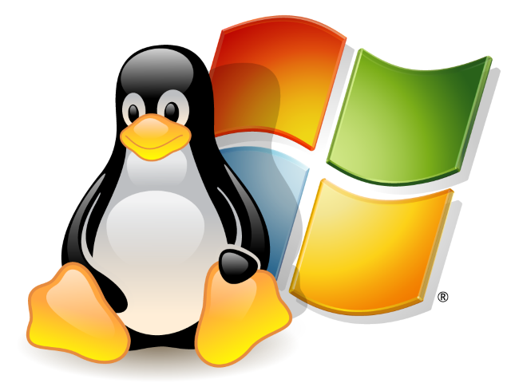
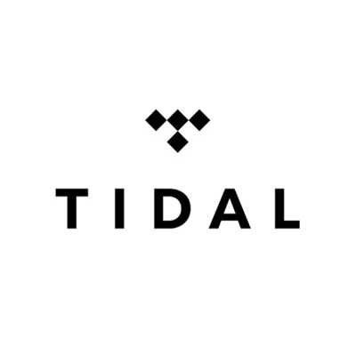
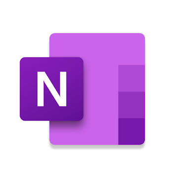
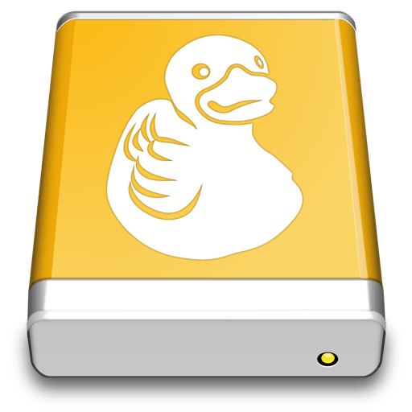
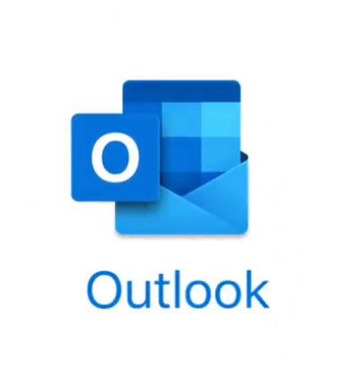
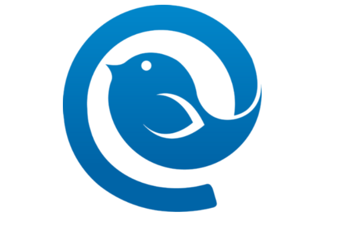
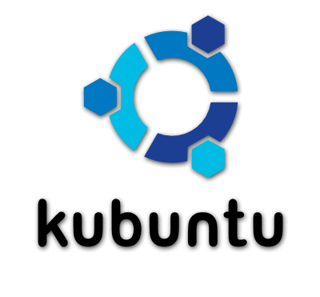

# Why I currently use Windows (and not Linux)

I grew up with an operating system that was way ahead of it's time - Amiga Workbench 1.3. So at a young age, I had an appreciation for operating systems.

In my teens and early adulthood, I was stuck with using Windows. Initially because I was sharing a PC. And this was also before Ubuntu became popular. (2003-2008) .

I then went to university. I did not initially have much of a deep interest in programming, however Uni re-sparked a fire for programming that I hadn't had since I was a kid. At the end of Uni, all I wanted to do was learn practical programming skills for fun and to better prepare myself for work. As an experienced programmer, I had an appreciation for Linux.

In Linux, it brings the development tools to your fingertips. You simply open a terminal, and compile and/or run your code in a few key presses. This is extremely useful for learning new programming languages, where you only want to write small bits of code at a time.

It's also good for medium-large projects, as you can navigate large amounts of code swiftly. And if you really need it, you can install a popular IDE such as Eclipse, JetBrains suite, CodeBlocks, etc.

So learning new programming languages became easy and fun. I coded a lot in Python, Web (Javascript) , lua (Love2D) and Java (with an IDE..).

I even used Linux in my professional job. It seemed to be capable of most (but not all) tasks required. Especially for development of web-related content.

There was one issue with Linux - it couldn't run all of my games. To solve this problem, I kept two computers, one for gaming and one for Linux (general purpose). It wasn't ideal, but it was the most realistic.

But then, Microsoft released a very interesting Windows feature - Windows Subsystem for Linux.

Initially I was skeptical. Especially as a cross-platform game developer. I liked being able to develop games in a Linux-style way, on an OS that could run graphical and hardware-accelerated graphics.

But then I received a tax return. And I was looking for a replacement laptop as my current one had a few issues. There just so happened to be released, the Microsoft Surface Go tablet hybrid computer. I really like the form-factor and features of it. It's small, but not too small to be painful to type on (unlike certain 7" pocket laptops I've seen). So I pulled the trigger and bought one. Knowing that I'd have to switch back to Windows.

My initial impression was positive. It is a sleek device, with exceptional features such as slim keyboard cover, Windows Hello face recognition for login, touch screen and touch-enabled apps, kickstand, USB-C, good quality webcams, great colour accuracy display and very sleek design.

I wanted to use the Surface Go more than my old Linux laptop as it was nicer hardware, more portable, better battery life. I began to invest into the Windows ecosystem again.

**I discovered several programs/services in Windows that I have grown an appreciation for.**

## OneDrive

I liked the idea of using OneDrive - so that I don't need to use it as well as other cloud providers. It keeps things simple. However I have recently started using Nextcloud, but that's another story. But OneDrive is a decent service.

## Typora (cross-platform)

I began wanting a program to take notes better. One that was faster to load, and simple to use. I realised that Markdown was a good idea for this. I did some research into many Markdown editors, but Typora stood out, as it is more of a What-You-See-Is-What-You-Get editor, that also saves in Markdown format. I took notes using it for a while. I'm writing this blog post using it now and it's great! But then I discovered an alternative.. (keep reading)

## TIDAL Music

I had been using Spotify for a few years. Really liking how you can search for a lot of music, and easily keep up to date with new music. I tried TIDAL out of curiosity, and I was blown away by the difference in quality vs Spotify. It's night and day better (for a lot of tracks). This program does not have a native Linux client.

## OneNote!

I stared using OneNote after it's big 2018 update. I had been using Google Keep to take and manage notes. However you had to use it in a browser, which takes extra time to load. And I kind of want to start using less Google products. Plus OneNote organises notes in an easier to access way. And, it allows drawing with a pen. Over time, I have accumulated many notes in OneNote and I use it a fair bit almost every day. There is no native OneNote Linux client.

## Mountain Duck

I manage a lot of remote Linux systems. Web servers, Raspberry Pis, etc. And I desperately need a way to mount remote SFTP filesystems. Windows doesn't have this functionality, which is disappointing. After a bit of research into options, I settled with Mountain Duck. It works well, and lets you store many servers to mount directly in Windows as drive letters. It makes remote development so much easier.

## Outlook

I have been a long-time Thunderbird user. It allows for compacting a lot of messages on screen for quick sorting. It is a pretty capable program. However it has it's issues. It can slow down a fair bit with more messages. And recently, an update has broken compatibility with my favourite addon, Quick Folder Move. This addon let me quickly move emails into folders (eg purchases, work searches, clubs and communities, forum stuff, etc). And I just got tired of Thunderbird. As I had purchased Office 365 for OneDrive, I gave Outlook a go. It solved the issue of speed, and had recent folders as a right click option for moving to common folders. So it kept me happy for a while

## Mailbird

Then I gave Mailbird a go. I had seen it in the past, but wasn't sure about it as it has a rather simple interface, which looks kind of cheap, considering it's a paid software. But once I tried it out for a few days, I realised that it was far superior to Outlook. It has the Quick Folder Move functionality of Thunderbird. As well as decent Google integration (unlike Outlook) for contacts and calendar. I now use it happily each day :) 

### Other Programs

Other than these programs, I tend to use mostly cross-platform programs, like Libreoffice, Gnucash, Visual Studio Code, Firefox, JetBrains IDEs, Inkscape, GIMP, Godot Engine, to name a few.

After a while of using these Windows (and Mac)-only programs, I've settled in to them. I still kept using my Surface Go, over my Linux Laptop, for the most part.

Then, unfortunately, my old Linux laptop died. Whilst trying to swap the battery out to extend the battery life, I'm not sure what happened, but it now fails to boot.

I then needed a more powerful laptop for a new job I had just started. I had a spare Lenovo Thinkpad Yoga (2014). With a dual core i5, 8GB of RAM and 12.5" 1080p display. I had become so comfortable using Windows, that I put Windows on it. It turned out to be necessary to run a program for a temperature sensor device for a lab.

### Cross-platform game development with Allegro

Before I bough the Surface Go, I had started work on a game in Linux using the Allegro graphics library. It was quite simple to compile and run in Linux. However in Windows, it was more difficult. Using Windows Subsystem For Linux, I could compile the game for Windows, using MinGW-W64. However it complained about missing DLL files. I had to download the Allegro monolith DLL, and a couple of extra DLLs that the program gave errors for. Placing them in the root directory of the executable file allowed the program to run, and be deployable. Funnily enough, making the game deployable for Linux was much more difficult (but I did it, see my older blog post). So cross-platform game development is possible!

## New Laptop

After completing the job with my Lenovo Thinkpad Yoga, I had earned enough money to buy a new laptop. One with a quad core i7 and 16GB of RAM. Naturally, it came with Windows 10 Pro. It is an ASUS Zenbook S UX391UA. I needed something more powerful for bigger IDEs and running virtual machines. I researched a few, but settled on this one because I liked the design, and it had all the features I wanted, and was reasonably priced. Later after buying it, I bought an external GPU. Then sold my gaming desktop PC. Now this laptop is my work laptop, and gaming machine. This puts extra constraints on using Linux, as it requires good Thunderbolt support.

### New GPU - AMD RX 5700 XT

In my external GPU enclosure, I also have an AMD RX 5700 XT (AMD Navi). This was only supported after Linux kernel 5.3. And Ubuntu 18.04 is only up to kernel 5.0.

## Considering going back to Linux

After using Windows for a while, I started being curious about Linux again. It is a very fun platform, and there are so many distros to choose from. As I use a lot of cross-platform software, and the Windows-only software has alternatives (keep reading) I thought I could make the switch back.

### Alternatives to Windows-only software

#### OneNote - Joplin

Joplin sets out to be a cross-platform alternative to Evernote and OneNote. It features Markdown notes with cloud sync, organised by notebook and tag. Very similar to OneNote in layout. It however has some disadvantages vs. OneNote

* No drawing support - Can't use Surface/iPad/Android to make drawings
* Only basic Markdown format - not a rich text editor
* No shapes and diagrams

It's not all bad, it features some things that OneNote has, such as

* Mobile app
* Web clipper

It's technically acceptable as an alternative to OneNote. But, I've become so used to OneNote, that a downgrade in features would be a bit disappointing.

#### Mailbird - MailSpring

Mailspring is a very nice email client. I only really discovered it properly after I discovered Mailbird. It features the quick move keyboard shortcut, and Google integration. However, it does not have Google Contacts or Calendar integration built in. It's still better than Thunderbird and Outlook though. So I'd be happy using it, but Mailbird is just a bit better. Not bad for free!

#### TIDAL - Nuvola Player

Despite the lack of native TIDAL player on Linux, you can get a very similar experience on Linux. Using Nuvola Player. It's a bit tricky to set up, and the install instructions actually fail (there is a fix). But it works almost as well as the native TIDAL player. When I say almost, I mean that it's a bit slower, but that's about it. So not bad!

#### Mountain Duck - Linux File Manager

Naturally, Linux has SFTP mounting built-in to pretty much every file manager (hello, Windows, are you listening?). So you can just mount a SFTP filesystem, and add it to bookmarks. It is a bit nicer to use a separate program. But at least it works. Mountain Duck does have one feature that Linux doesn't. Which is offline syncing. You can mount a remote filesystem, and then select files and folders to save offline, when disconnected from the remote filesystem. Kind of like Smart Sync for Dropbox. I have used it, and it's a little buggy, but when it works, it's nice.

## Then I gave Linux a go

To satiate my curiosity, I installed Linux. 

### Ubuntu

I first installed vanilla Ubuntu. Which worked quite well, but I didn't really like the UI of Ubuntu. GNOME is still slow, despite efforts otherwise. And, it may seem minor, but to me it's a big deal. Ubuntu and GNOME do not have the ability to let you click on a dock item to minimise the program. Almost every other desktop has this feature! I've become so used to it, that it pains me when I instinctively try to click a dock item and it doesn't minimise.

### Kubuntu

I have fond memories of using Kubuntu in the past. I tried Kubuntu 19.10. It's alright. It's however a bit complex. It also has an annoyance. New windows usually do not open centered to the middle of the screen. Thus, you have to manually drag them to the center to be easier to use. This gets old fast. But that issue wasn't the reason why I stopped using it. When I disconnected and reconnected my USB-C charging cable, the whole OS locked up. the cursor still moved, but everything else was frozen. So that was a bust.

### Elementary OS!

Elementary OS is an incredibly beautiful and responsive OS. I'm a bit picky with design, even GNOME has it's noticeable design issues to me. I was initially hesitant to use elementary OS. I think it's a great OS, however it has one annoying problem. No system tray. I complained about it on Twitter to the elementary account. They actually responded with a YouTube [https://www.youtube.com/watch?v=fPFdV-Z69Lo&feature=youtu.be](https://www.youtube.com/watch?v=fPFdV-Z69Lo&feature=youtu.be) video, explaining how the system tray is an outdated design concept, and they are doing a lot to replace it with other things. I kind of got on board with their thinking, and gave it a go. I installed it, but when it booted up for the first time, there was a blank screen with a blinking cursor. Unplugging the external graphics card fixed it. So I deducted that there wasn't proper hardware support for my eGPU. I installed the rather useful Ukuu (Ubuntu Kernel Update Utility). To Update the kernel to the latest available (5.4). That fixed it! I then updated the mesa (AMD graphics) drivers to the latest for better GPU performance. Things were running well, however I wasn't happy that my system was running on experimental kernel/drivers.

I then encountered a familiar issue. When I was using Linux before, the performance of the GUI was often slow when you had multiple monitors. I had the main monitor, plus the laptop monitor running. And the GUI was still rather laggy. It's a shame that this issue still hasn't been fixed, years on. I suspect it may be a limitation of X11. Moving to Wayland might fix it. Another fix is buying a monitor with a higher resolution.

With the system tray gone, and developers yet to catch up with alterative APIs, that was another reason why I thought it wasn't quite time yet to use Linux.

## Games

Here's the big one. Games. Steam has done some amazing work with Proton, allowing Windows-only games to run in Linux using WINE and DXVK. Not all games work though. Some won't work because of DRM and anti-cheat blocking it. 

But there are a lot of good games outside of Steam. Battlenet, Origin, Epic Store, GoG Galaxy, etc. This is where Lutris comes in. Unfortunately, my experience with Lutris hasn't been good. I tried installing Borderlands 3 using the Lutris installer, but it ultimately didn't work. It loaded the intro movies, but the game didn't load. This is somewhat reflective of the nature of a community-driven tool that isn't quality-tested by the developers of actual games. There are a lot of games that do work well. However much newer and more compelling games are a bit unreliable.

Also, I own games on the **Windows Store** (maybe a mistake, but oh well) Such as Forza Horizon 3 and State of Decay 2. In Linux, there is no way to get these to run. Or any other games bought in the Windows Store.

So ultimately, the experience of PC gaming is still far superior on Windows than Linux (and also Mac..) It's doable in Linux, and there is a pretty decent range. But you will be missing out on some notable games. And it's a hassle to get some working.

## Simplicity of Use

One thing I have grown to like about Windows (versus Linux) is it's simplicity. Programs download and install in easy to understand ways. They can be pinned to the taskbar and launched easily. The system tray can be managed. The UI is simple. Most apps auto-update or update through distribution services such as Windows Store, Steam, etc. Things also just work. Printers have good drivers. A lot of software and games has had a lot of quality-assurance testing applied to it, so that it works, and works pleasantly. It feels like I can get on with my life and focus on things other than my computer's operating system. 

Elementary OS is the closest distro to achieving this level of simplicity, however it still has some issues, mainly in third-party developers not supporting Linux well, or hardware limitations. I feel it's the best hope that Linux has of being a serious alternative to Windows and Mac. But not for me, just yet.

## Back to Windows (again)

I can still do pretty much everything I want to do. Write cross-platform programs and games. Use cross-platform software. Mount remote SFTP filesystems. Run Linux command line programs (such as Python, NodeJS, C, C++, etc). It's not quite as good for development, but it's much better for everything else.

## Things Linux Could Do Better

* Alternative program to OneNote with pen support (or even native OneNote client!)
* Game developers supporting Windows games on Linux by helping to create installers with Lutris
* Ability to update kernel and graphics drivers safely in LTS releases
* Switch to Wayland, and make Wayland better (eg. screen capturing and performance boost)
* Better Thunderbolt support for eGPUs outside of GNOME
* More quality assurance in software, especially for very useful tools like note taking, email, music players, cloud storage
* Don't be afraid to sell software - Good software is good software

## Things Windows Could Do Better

* WSL with display and hardware support (graphics and sound)
* Have a central repository for some cross-platform applications so they update like they do in Linux
* Support for mounting SFTP filesystems, so you don't need to pay money for solutions
* Windows Store - needs a bit of a UI overhaul
* Printers - minimise bloatware included with printer software (Like Linux) - hello printer makers
* Better integration for cloud storage providers, including smart sync for all cloud providers
* Alternative to the system tray - an API for small icons
* Better notifications, more like Android
* Make it possible to play Windows Store games on Linux