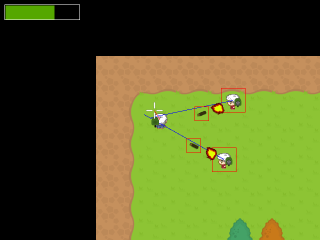

# Wizards with Rockets Event Callbacks

This is my first post about my game, Wizards with Rockets! For those that don't know, Wizards with Rockets (wwr) is a top-down multiplayer shooter with AI bots, written in C.



In wwr, the collision system checks for collisions every frame. On a collision, you may want something to happen, eg, player reduces health by a certain amount. The problem is that a collision can happen over many frames, and thus the action you want to take would be called many times.

To resolve this, I implemented an event system in C. On a collision, it makes a call to the event system to register an event, named with a string.

```C
bool collision = rect_collision(&rockets[i].obj, player_ptr, rocket_collide_dirs, bgnd);
if(collision){
	//player_take_hit(); -- old method called every collision frame
	register_collision(&rockets[i].obj, player_ptr, rocket_collide_dirs, 	"rocket-player collision");
} else {
	remove_collision(&rockets[i].obj, player_ptr);
}
```

As the code shows, it registers a collision, passing in the objects, collision directions and the event name string.

In the file gameobject.h, it contains the function definition for **register_collision()**

```C
bool added_collision = false;
a->col_info.name = NAME;
a->col_info.collision_dirs = col_dirs;
b->col_info.name = NAME;
// Look through each per-object collision
for(int i = 0; i < MAX_PER_OBJECT_COLLISIONS; i++){
	// If collision already addded
	if(a->collisions[i] == &b->col_info){
		// skip
		added_collision = true;
		i = MAX_PER_OBJECT_COLLISIONS;
	}
}
// Bind collision objects from a->b
if(!added_collision){
	for(int i = 0; i < MAX_PER_OBJECT_COLLISIONS; i++){
		if(a->collisions[i] == NULL){
			// add object b's collision info
			a->collisions[i] = &b->col_info;
			added_collision = true;
			i = MAX_PER_OBJECT_COLLISIONS;
			// Call collision event by string name
			call_collision_callback(NAME);
			printf("Added new collision (a) %s\n", NAME);
		}
	}
}
// After successful collision add
if(added_collision){		
	for(int i = 0;i < MAX_PER_OBJECT_COLLISIONS; i++){
		// If collision already binded
		if(b->collisions[i] == &a->col_info){
			// skip
			added_collision = true;
			i = MAX_PER_OBJECT_COLLISIONS;
		}
	}
	// bind from b->a
	if(!added_collision){
		for(int i=0; i < MAX_PER_OBJECT_COLLISIONS; i++){
			if(b->collisions[i] == NULL){
				// add object b's collision info
				b->collisions[i] = &a->col_info;
				added_collision = true;
				i = MAX_PER_OBJECT_COLLISIONS;
				printf("Added new collision (b) %s\n", NAME);
			}
		}
	}
}
```
In short, both objects are bound to each other if not already and the event callback gets called (only once) .

Before the call_collision_callback can be called, it needs to be registered first.

```C

void register_collision_callback(const char * event_str, void (* callback)()){
	bool added_callback = false;
	
	// look through all potential collision events
	for(int i = 0; i < MAX_COLLISION_EVENTS; i++){
		// if callback already added 
		if((collision_cb_names[i][0] != 0) && (strcmp(collision_cb_names, event_str) == 0)){
			added_callback = true;			
			i = MAX_COLLISION_EVENTS;
		}
		
	}
	// if not added, add it in an empty spot
	if(!added_callback){
		for(int i = 0; i < MAX_COLLISION_EVENTS; i++){
			// found an empty string
			if(collision_cb_names[i][0] == 0){
				strcpy(collision_cb_names[i], event_str);
				collision_callbacks[i] = callback;
				i = MAX_COLLISION_EVENTS;
			}
		}
	}
}
```
It's rather, simple. It checks if it has already been added (compare strings) and adds the function to an array of functions as declared in gameobject.h- 
```C
void (*collision_callbacks[MAX_COLLISION_EVENTS])();
```

Now, to call an event callback (as described above in register_collision)
```C

void call_collision_callback(const char * cb_str){
	for(int i = 0; i < MAX_COLLISION_EVENTS; i++){
		// if array name is not empty and names match, call the appropriate function
		if(collision_cb_names[i][0] != 0 && strcmp(collision_cb_names[i], cb_str) == 0){
			(*collision_callbacks[i])();
			i = MAX_COLLISION_EVENTS;
		}
	}
}
```
And that's it. There's much more to my code. 

There's room for improvement - eg hash table to improve performance. And adding event data. But I'm just glad that it's working :)