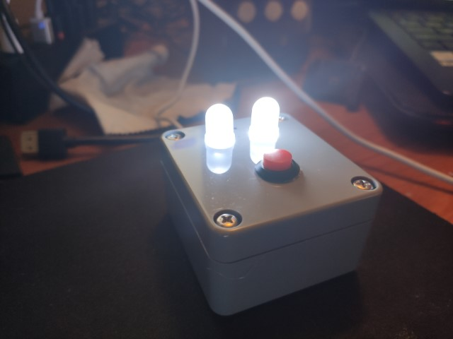
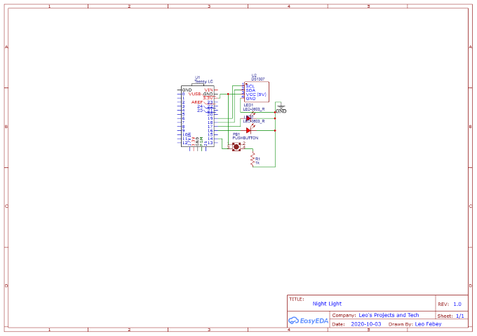

# YouTube Project Series Video 01 - Automatic Night Light
[plugin:youtube](https://www.youtube.com/watch?v=vQsacHNWxhs)  
I've made my first proper YouTube video! I'm making a series, where a make one video per month about a small, easy and affordable electronics project.

## Night Light
  
The first video of the series is about an automatic night light that comes on at a certain time, then switches off at another time.  
I recorded myself making the project then narrated over the top of it. With an intro and outtro.

It was a pretty simple project that probably many people can also make! But I wanted to make it for my own benefit - to help me get to bed earlier.

## Resources
### Schematic
  

### GitHub Repo
[GitHub - Automatic Night Light](https://github.com/l33tllama/ArduinoAutomaticNightLight)

