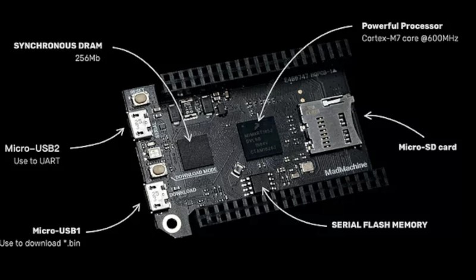
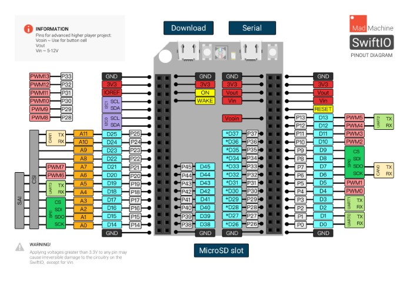

# YouTube Project Series Video 02 - MadMachine SwiftIO Showcase
[plugin:youtube](https://youtu.be/pX1bvjG6Myo)  
My second YouTube video! As I planned, making a (roughly) monthly YouTube video about an electronics project or similar thing. In the second video, it is not a project but more of a showcase of the MadMachine SwiftIO development board - which is currently in development and is being given to some people for testing. It was my entry into programming in Swift and I have picked it up quickly. A cool little board that currently has limited uses but may have some exciting practical uses in the future.

## MadMachine

### Features:
* i.MX RT1052 Crossover Processor with Arm® Cortex®-M7 core @600MHz
* Micro SD card slot, supporting standard and high capacity SD cards
* Micro USB connector for power
* On-board USB to UART for serial communication
* 46 GPIO on left and right edges
* On-board GRB LED
* 12x 12-bit analog to digital (ADC) converters
* 4 UART, 2 CAN, 2 IIC, and 2 SPI
* 14 PWM pins
* Many additional advanced features to meet the needs of advanced users 

It also features a custom IDE and command line tools for compiling and uploading code. As well as numerous example programs.

## Resources
### Pinout Diagram
  
Discord link (limit 25 people) [https://discord.gg/7JCkG9CyED](https://discord.gg/7JCkG9CyED)  
HC-SR04 Ultrasonic SwiftIO library: [https://github.com/l33tllama/MadMachine_HC-SR04](https://github.com/l33tllama/MadMachine_HC-SR04)  
[MadMachine Website](http://madmachine.io)