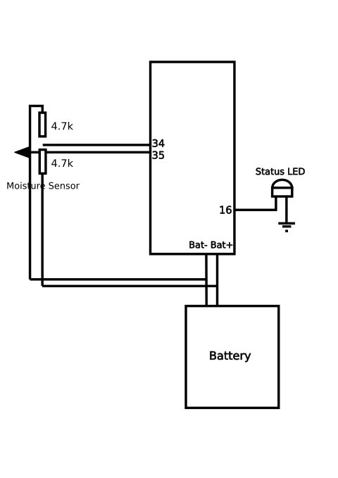

# YouTube Project Series Video 03 - Plant Water Reminder Device
[plugin:youtube](https://youtu.be/pX1bvjG6Myo)  
My third YouTube video! This video is about my plant water reminder device. It is a box that has a moisture sensor attached that reads the moisture value of a plants soil. It then sends notifications to a phone if the moisture level is too low. Good for lazy people like me!  
In the video it shows the build and coding process, plus challenges and future improvements.

## Required Components
* Sparkfun ESP32 Thing
* 2x enclosures for batteries
* 1x enclosure for ESP32
* 1x enclosure for charger
* 2x RCA sockets for charger and ESP32 box
* 1x AC adapter socket
* 2x LiPo rechargeable batteries
* Various wires
* 3x LEDs (1x 5mm red, 1x 3mm green, 1x 3mm red)
* 2x 4.7k resistors
* Heat shrink

## Required Tools
* Soldering iron and solder
* Wire strippers
* Hot glue gun with several glue sticks
* Phillips screwdriver (for enclosure)
* Drill with drill bit set
* Plier cutters
* Heat shrink
* Recommended – Desoldering braid
* Recommended – Helping hands

## Basic Schematic

## Github repo

[https://github.com/l33tllama/ArduinoPlantWaterReminder](https://github.com/l33tllama/ArduinoPlantWaterReminder)

